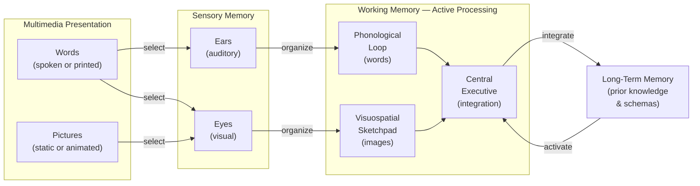
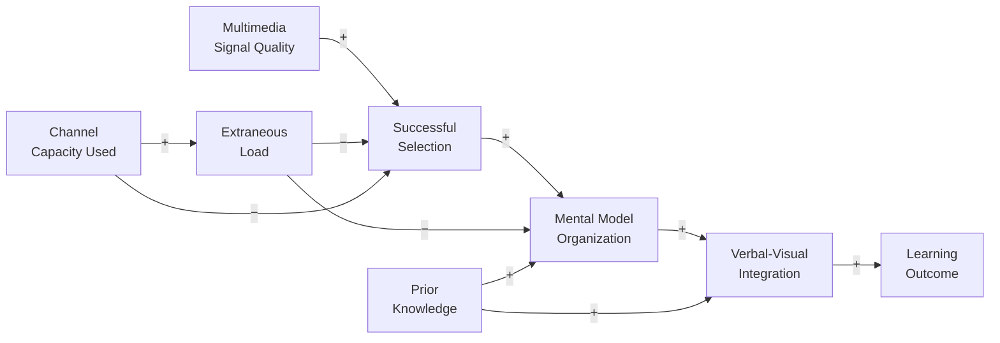

# Appendix A: Cognitive Theory of Multimedia Learning (CTML)

!!! mascot-welcome "Welcome — The Science Behind Words and Pictures"
    
    Chapter 4 introduced multimedia learning as one piece of a larger cognitive architecture. This appendix gives it a room of its own. Here we trace the full theoretical structure of CTML — the three assumptions that underpin it, all twelve empirically-tested design principles, and the honest account of where the evidence is strong and where it is still settling. Let's build a mental model of the model itself.

## Overview

*Cognitive Theory of Multimedia Learning* (CTML) is a theoretical framework developed by Richard Mayer, a cognitive psychologist at the University of California, Santa Barbara, who has studied how people learn from words and pictures since the early 1990s. The core claim is straightforward: **people learn more deeply when related verbal and visual information are presented together than when either is presented alone** — provided the presentation respects the brain's cognitive architecture rather than fighting it.

That qualifier — "provided the presentation respects the cognitive architecture" — is where most of the work happens. A screen crammed with talking heads, scrolling text, and spinning graphics is technically "multimedia." CTML explains why it also fails, names the structural reasons, and offers twelve testable principles for doing it right.

CTML is not an island. It sits in a family of three complementary frameworks:

- *Dual Coding Theory* (Paivio, 1971) — the architectural claim that verbal and visual information are processed in separate channels.
- *Cognitive Load Theory* (Sweller, 1988) — the engineering claim that each channel has limited capacity, and that instructional design must budget that capacity deliberately.
- *CTML* — the applied synthesis that takes both findings as inputs and derives specific, empirically tested design rules for multimedia instructional materials.

!!! mascot-thinking "Not Three Theories — One Theory in Three Lenses"
    
    Dual Coding gives us the channel model. Cognitive Load Theory gives us the capacity constraint. CTML takes both and asks: "Given these constraints, what should we actually *build*?" Each lens sharpens the picture. You need all three to make principled design decisions rather than aesthetic ones.

## The Three Cognitive Assumptions

CTML rests on three foundational assumptions about how the human mind processes information. These are not speculative — each has a long empirical lineage independent of CTML itself.

### 1. Dual-Channel Assumption

The human cognitive system includes **separate channels for processing verbal (auditory) and visual (pictorial) information**. This maps directly to Baddeley's working-memory model: the phonological loop handles spoken and written words; the visuospatial sketchpad handles images, diagrams, and spatial layouts. The two channels can operate simultaneously without directly competing.

The design implication: a narrated animation places verbal content in the auditory channel and visual content in the visual channel, leaving both channels available. A screen with a diagram *and* the same information as on-screen text asks the visual channel to process the diagram *and* the text, crowding a channel that was already occupied.

### 2. Limited-Capacity Assumption

**Each channel can process only a small amount of information at one time.** This is the cognitive load constraint, now applied per channel rather than globally. The phonological loop holds roughly two seconds of sound; the visuospatial sketchpad holds roughly four visual-spatial elements. Presenting too many words, too many images, or too much of either simultaneously exhausts the relevant channel and prevents meaningful processing.

The design implication: coherence is not an aesthetic preference — it is a capacity constraint. Every extraneous word or decorative image consumes channel capacity that could have gone toward understanding the essential content.

### 3. Active-Processing Assumption

**Meaningful learning requires active cognitive engagement — selecting, organizing, and integrating information.** Passive exposure does not produce durable learning. The learner must select relevant words from the verbal stream and relevant images from the visual stream, organize each into a coherent mental representation, and integrate the two representations with prior knowledge.

This is the assumption that separates CTML from a simple "words + pictures = learning" claim. The theory holds that multimedia works *because* it gives the learner two complementary representations to organize and integrate — not merely because it delivers more information through more modalities.

### The CTML Cognitive Model

The following diagram shows how the three assumptions interact in the learner's cognitive system. Read it left to right: the world presents words and pictures; the learner's senses receive them; working memory selects, organizes, and integrates; long-term memory provides prior knowledge to anchor the new structure.

The key insight is the two separate paths from the input to working memory — the auditory-phonological path and the visual-visuospatial path — and the single integration point in the central executive. Good multimedia design sends complementary, non-redundant content down both paths simultaneously, maximizing the information that reaches integration without overloading either path.

## The Twelve Multimedia Learning Principles

Mayer and colleagues have identified twelve design principles through controlled experiments, each yielding a specific prediction about when multimedia presentations produce better or worse learning outcomes. The principles cluster naturally by the problem they solve.

### Principles That Reduce Extraneous Processing

These four principles target information that is present in the presentation but adds no learning value — the designer's responsibility to eliminate.

| Principle | Statement | Effect size (Cohen's *d*) |
|---|---|---|
| **Coherence** | Exclude extraneous words, pictures, and sounds | Strong (≈0.8–1.0) |
| **Signaling** | Add cues that highlight the essential structure | Moderate (≈0.6–0.8) |
| **Redundancy** | Do not narrate on-screen text verbatim | Moderate (≈0.5–0.8) |
| **Spatial Contiguity** | Place corresponding text and graphics near each other | Moderate–strong (≈0.7–1.0) |
| **Temporal Contiguity** | Present corresponding words and images simultaneously, not sequentially | Moderate–strong (≈0.7–1.0) |

**Coherence** is the most robust finding in the multimedia learning literature and the most actionable. Removing a seductive but irrelevant detail — an interesting anecdote, an atmospheric background sound, a decorative stock image — consistently improves learning outcomes. The mechanism is extraneous load: every element the learner processes that does not contribute to the learning goal costs capacity that could have gone to understanding.

**Redundancy** is a common footgun in textbook design. When a narrator reads the same text that appears on screen, the phonological loop receives the spoken words *and* the visual channel works to read the printed words — processing the same information twice through pathways that were designed to carry different content. The result is interference, not reinforcement. The remedy is to use either narration *or* on-screen text to deliver verbal content, not both simultaneously.

!!! mascot-warning "The Redundancy Trap"
    
    The redundancy principle surprises most instructors. "Showing and saying the same thing should reinforce the message" — that intuition is wrong, and the experiments are clear. If your MicroSim narrates an equation while also displaying it as on-screen text, you are generating redundancy load, not emphasis. Choose one channel for each piece of verbal content.

### Principles That Manage Intrinsic Processing

These three principles address the complexity inherent in the material itself — helping learners build the cognitive scaffolding they need before tackling the full complexity.

| Principle | Statement | Notes |
|---|---|---|
| **Segmenting** | Present material in learner-paced segments rather than as a continuous unit | Especially important for fast-paced animations |
| **Pre-training** | Teach the names and characteristics of key components before the main lesson | Reduces intrinsic load during the main presentation |
| **Modality** | Present explanatory words as narration rather than on-screen text when paired with graphics | Frees the visual channel for the graphic |

**Segmenting** is the principle that justifies the "next" button in MicroSims. When content is continuous — an animation that runs for ninety seconds — a learner who falls behind cannot pause the stream. Breaking the animation into learner-paced chunks gives the working memory time to integrate before the next segment arrives.

**Pre-training** addresses intrinsic load by front-loading vocabulary. A learner who does not know what "visuospatial sketchpad" means before seeing the working-memory diagram must simultaneously decode the term and process its role in the system — two high-load operations where one would suffice. Teaching the vocabulary in a low-stakes, no-diagram phase first clears that load from the main lesson.

### Principles That Foster Generative Processing

These four principles encourage the active cognitive engagement that produces durable, transferable understanding — not just recognition memory.

| Principle | Statement | Caution |
|---|---|---|
| **Multimedia** | Words and pictures together produce better learning than words alone | The baseline — necessary but not sufficient |
| **Personalization** | Conversational style produces better learning than formal style | Replication weaker than for coherence |
| **Voice** | A human voice produces better learning than a machine voice | Evidence is more mixed in recent years with better TTS |
| **Image** | Adding the speaker's image to the screen does not improve learning | Often mistaken as a generative addition |

The **Multimedia** principle is the foundational claim: two well-designed channels beat one. But "well-designed" is doing most of the work in that sentence. Two channels that carry redundant content, or that overwhelm the learner with extraneous information, can *hurt* learning relative to a clean single-channel presentation.

The **Image** principle is the most counterintuitive. Showing the speaker's face alongside the content — a common design choice in video courses — does not reliably improve learning outcomes and can reduce them if the face competes for visual attention with the relevant diagram. A talking head is not a free addition to working memory capacity.

!!! mascot-thinking "Evidence Gradients in CTML"
    
    Not all twelve principles have equal empirical weight. Coherence, spatial contiguity, and temporal contiguity have strong, replicated evidence bases. Voice and personalization have moderate evidence with notable replication concerns. Image and redundancy effects depend heavily on how the materials are designed. Use the principles as ranked priorities, not as an equal-weight checklist.

## Causal Loop View: How the Dual-Channel Model Produces Learning

The three-part CTML process — selecting, organizing, integrating — is not a linear pipeline. Each stage feeds the others, and breakdowns in one stage create downstream failures. The diagram below shows the key causal relationships.

**R1 — The Learning Flywheel.** Better prior knowledge makes organization and integration easier; successful integration builds richer prior knowledge for the next lesson. This is the productive flywheel: well-designed multimedia gets the wheel spinning.

**B1 — The Capacity Brake.** High extraneous load uses up channel capacity; a depleted channel cannot support selection; poor selection leaves the organization and integration stages with incomplete raw material; learning suffers; the learner's confidence in their prior knowledge may actually drop, making future material feel harder. One poor design decision cascades.

## Design Checklist for Intelligent Textbooks

The following checklist applies CTML principles to the specific context of MkDocs-based intelligent textbooks with MicroSims.

### For every chapter page

- [ ] Each section uses at most one primary visual (diagram, infographic, or MicroSim) — no decorative stock images.
- [ ] Captions are placed directly adjacent to the figure they describe (spatial contiguity).
- [ ] Figures are introduced *before* the prose that refers to them, so the reader sees the structure before reading the explanation.
- [ ] Section headers and admonitions signal the structure of the content explicitly (signaling).
- [ ] The first occurrence of every key term is italicized and glossed in the same sentence (pre-training at the term level).

### For every MicroSim

- [ ] Controls are labeled with plain English, not variable names (coherence).
- [ ] No background music or atmospheric sound effects (coherence).
- [ ] If audio narration is used, the same text does not also appear as on-screen caption (redundancy).
- [ ] Fast-moving animations include a step-through or pause control (segmenting).
- [ ] The simulation is preceded by a brief "what you're about to see" orientation that names the key components (pre-training).
- [ ] The canvas and controls are laid out so that related elements are spatially adjacent (spatial contiguity).
- [ ] Conversational labels are used ("drag the slider to change difficulty" rather than "adjust the intrinsic-load parameter").

### For admonitions and mascot dialogue

- [ ] Mascot dialogue is in conversational, first-person voice (personalization).
- [ ] Each admonition carries a single, focused message — not a summary of the preceding section (coherence).
- [ ] Mascot image and text are vertically aligned so the image does not appear to float (spatial contiguity).

## Evidence Base and Honest Limitations

CTML rests on a large experimental literature — Mayer and colleagues report meta-analytic effect sizes averaging around 1.5 standard deviations for the combined multimedia effect in laboratory conditions. That number deserves several caveats.

**Ecological validity.** Most CTML experiments involve university undergraduates studying short (five-to-fifteen-minute) science lessons in laboratory conditions, often with immediate posttests. Effect sizes in classroom field studies with longer lessons and delayed posttests are substantially smaller — often below 0.4 *d*. The laboratory-to-classroom gap is real and should temper enthusiasm about specific effect-size claims.

**Publication bias.** As with most educational psychology, the published literature over-represents positive results. Null results for some of the weaker principles (voice, image, personalization) have appeared more frequently in recent years, especially with high-quality text-to-speech replacing robotic machine voices.

**Moderators matter.** The coherence effect is larger for low-prior-knowledge learners than for experts. The modality effect depends on the pace of the material. The pre-training effect disappears when learners already know the components. Applying a principle without checking whether its preconditions hold is a common design error.

**Replication landscape.** The coherence, contiguity, signaling, and multimedia principles have strong replication records. Segmenting and pre-training are well-supported with moderate effect sizes. The personalization, voice, and image principles have weaker and more contested evidence bases. Apply the first group as near-certain design rules; apply the second group as useful defaults that should yield to contrary local evidence.

!!! mascot-encourage "Working with Uncertainty"
    
    The fact that not all twelve principles replicate equally is a feature of science, not a flaw in the theory. Knowing *which* principles are rock-solid and which are provisional lets you allocate your design effort where it has the most certain payoff — and that's a much better position than treating every heuristic as equally authoritative.

## Retrieval Practice

Close the appendix and try these from memory. Check back only after you've committed to an answer.

1. Name CTML's three cognitive assumptions. For each one, state which component of Baddeley's working-memory model it most directly connects to.

2. A colleague argues: "I always show a diagram and read the caption aloud — it gives learners two ways to get the information." Which CTML principle does this violate, and why does the research say it hurts rather than helps?

3. Rank these four CTML principles from strongest to weakest empirical evidence: voice, spatial contiguity, coherence, image. Explain one moderator variable that changes when a principle applies.

4. A MicroSim runs a thirty-second animation that a learner cannot pause. Which principle is being violated? Describe the specific redesign that fixes it.

## Key References

- Mayer, R. E. (2009). *Multimedia learning* (2nd ed.). Cambridge University Press.
- Mayer, R. E. (Ed.). (2014). *The Cambridge handbook of multimedia learning* (2nd ed.). Cambridge University Press.
- Paivio, A. (1991). Dual coding theory: Retrospect and current status. *Canadian Journal of Psychology, 45*(3), 255–287.
- Sweller, J. (1988). Cognitive load during problem solving: Effects on learning. *Cognitive Science, 12*(2), 257–285.
- Sweller, J., van Merriënboer, J. J. G., & Paas, F. (2019). Cognitive architecture and instructional design: 20 years later. *Educational Psychology Review, 31*(2), 261–292.

!!! mascot-celebration "You've Read the Full Model"
    
    CTML is one of the most thoroughly tested frameworks in the learning sciences — and now you can read a paper that invokes a "multimedia principle" and immediately ask: which one, what effect size, what study design, and what were the moderators? That's the move from recall to evaluation. Use it.
