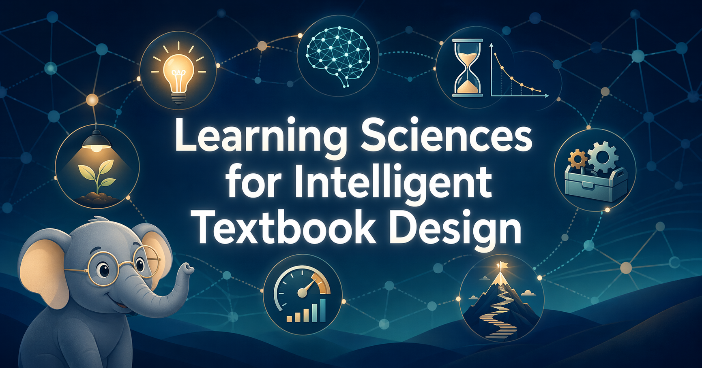

# Welcome

<figure markdown>
  { width="100%" }
</figure>

Welcome to **Learning Sciences for Intelligent Textbook Design** — a hands-on book for people who want to build next-generation educational content with AI, and who want the learning sciences to be the reason it actually works.

## About This Book

Learning Sciences is an emerging interdisciplinary field that synthesizes cognitive science, educational psychology, neuroscience, and instructional design to explain how people actually learn — and how we can design environments, content, and feedback loops that accelerate that learning.

This book is organized around the **Seven Domains of the Learning Sciences**:

1. **Learner Motivation and Engagement** — the gateway to attention and encoding
2. **Understanding New Knowledge and Ideas** — how meaning is constructed
3. **Knowledge Retention** — turning encounters into durable memory
4. **Knowledge Application** — using what we know in new situations
5. **Building Expertise and Mastery** — from novice to pattern-recognizer
6. **Measuring Learning and Optimizing Feedback** — closing the assessment loop
7. **Creating and Improving Learning Conditions** — the environment that holds it all together

What makes this book distinctive is its relentless focus on **application through AI**. We treat the learning sciences not as abstract theory but as a practical toolkit for authors building **interactive intelligent textbooks** with tools such as Claude Code, Claude Agent Skills, MkDocs Material, MicroSims, and learning-graph-driven content pipelines.

## Who This Book Is For

- Graduate students in learning sciences, instructional design, and educational technology
- Adult continuing education learners
- Instructional designers and curriculum developers
- Educational technologists
- Professional developers interested in authoring AI-augmented learning experiences

No programming experience is required. Basic familiarity with Markdown and generative AI tools is helpful but not assumed.

## How to Use This Book

Use the left navigation to explore:

- **Chapters** — the main narrative, one chapter per key idea
- **Learning Graph** — an interactive map of the 200+ concepts and their dependencies
- **MicroSims** — small, hands-on interactive simulations you can run in the browser
- **Glossary** — concise definitions for every term introduced in the book
- **Instructor's Guide** — classroom tips, pacing suggestions, and customization instructions

Along the way, you'll meet **Bloom the Elephant**, our learning mascot. Bloom shows up to flag a key idea, warn about a common trap, or nudge you to pause and retrieve what you just read.

## A Note on Scope

This book teaches **Level 2** of the five-level classification of intelligent textbooks — interactive textbooks built with learning graphs, MicroSims, and path recommendations that require **no collection of individual student data**. The jump from Level 2 to Level 3 is the **privacy inflection point** where FERPA, COPPA, GDPR, and CCPA/CPRA obligations begin. We name that boundary and deliberately stop there.

## Getting Started

Start with [Chapter 1: Foundations](chapters/01-foundations/index.md) to begin.

Ready? Let's build a mental model.
