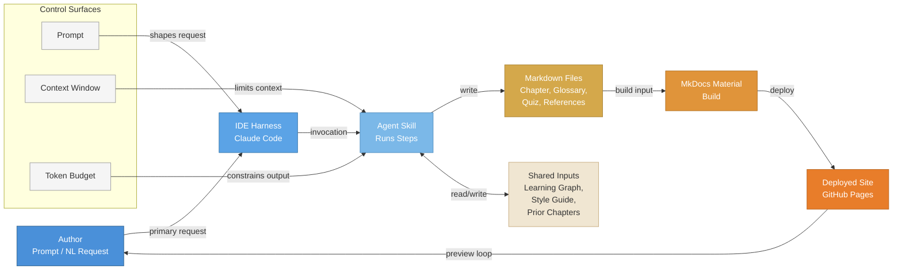

# The Authoring Pipeline - Prompt to Published Site

<iframe src="main.html" height="600px" width="100%" scrolling="no" style="border: 1px solid #ddd;"></iframe>

[Run the Authoring Pipeline Architecture Fullscreen](./main.html){ .md-button .md-button--primary }

## About This MicroSim

A Mermaid flowchart LR diagram showing six horizontal stages of the intelligent textbook authoring pipeline, each labeled and colored distinctly on a blue-to-orange palette. The stages are: Author, IDE Harness (Claude Code), Agent Skill, Markdown Files, MkDocs Material Build, and Deployed Site (GitHub Pages). A side panel labels the three control surfaces -- Prompt, Context Window, and Token Budget -- with arrows showing where each lands in the flow. A feedback arrow from the deployed site back to the author completes the preview loop.

## Diagram Details

## Related Resources

- [Chapter 10: Intelligent Textbook Architecture and AI Tooling](../../chapters/10-textbook-architecture/index.md)
