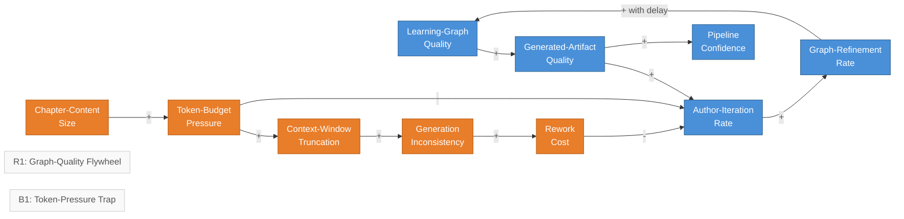

# Authoring Pipeline Dynamics - Graph-Quality Flywheel vs. Token-Pressure Trap

<iframe src="main.html" height="600px" width="100%" scrolling="no" style="border: 1px solid #ddd;"></iframe>

[Run the Authoring Pipeline Dynamics Fullscreen](./main.html){ .md-button .md-button--primary }

## About This MicroSim

A causal loop diagram with ten variable-nodes and two named loops. **R1 (Graph-Quality Flywheel)** shows how learning-graph quality raises artifact quality, which raises iteration rate, which raises graph-refinement rate, which raises graph quality -- a reinforcing productive loop. **B1 (Token-Pressure Trap)** shows how chapter-content size raises token-budget pressure, forcing context-window truncation, creating generation inconsistency and rework cost, which throttles iteration and starves R1. The cross-links from B1 into R1 are highlighted in red.

## Diagram Details

## Related Resources

- [Chapter 10: Intelligent Textbook Architecture and AI Tooling](../../chapters/10-textbook-architecture/index.md)
