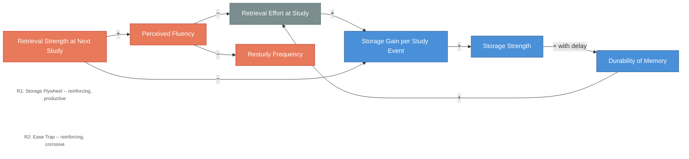

# Bjork's Storage Dynamics -- Flywheel and Ease Trap

<iframe src="main.html" height="600px" width="100%" scrolling="no" style="border: 1px solid #ddd;"></iframe>

[Run the Bjork Storage Dynamics Diagram Fullscreen](./main.html){ .md-button .md-button--primary }

## About This MicroSim

This causal loop diagram illustrates two key dynamics from Bjork's theory of desirable difficulties. R1 (Storage Flywheel) is the productive loop: effortful retrieval produces large storage gains, which accumulate as storage strength, which translates into durable memory, which -- after a delay on the next spaced review -- requires real effort to retrieve, feeding the flywheel again. R2 (Ease Trap) is the corrosive loop: high retrieval strength produces perceived fluency, which reduces restudy frequency and lowers retrieval effort, which in turn yields small storage gains. The ease trap feels like learning but starves durability. Retrieval effort at study is the shared pivot node -- the lever that determines which loop dominates.

## Diagram Details

## Related Resources

- [Chapter 5: Knowledge Retention](../../chapters/05-knowledge-retention/index.md)
