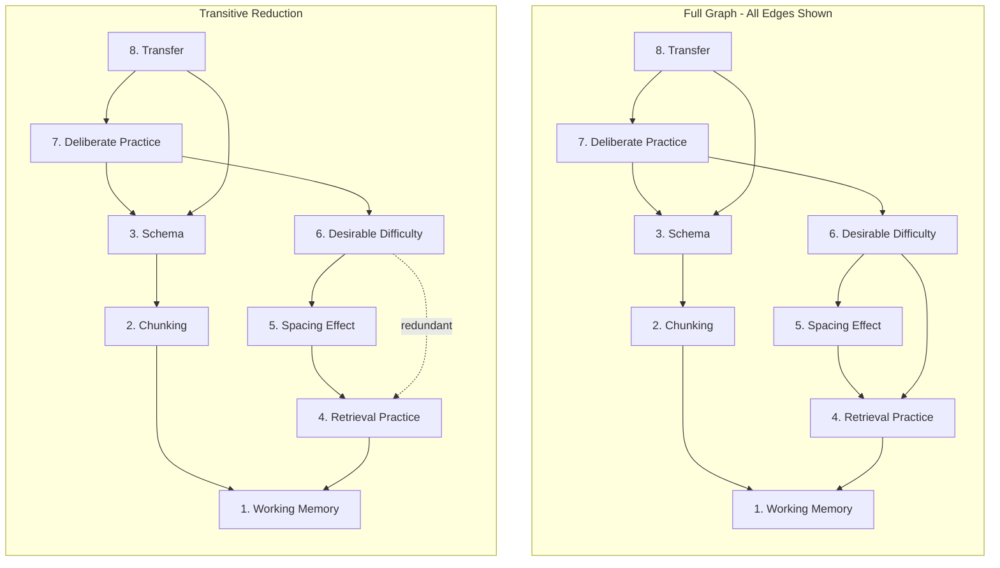

# A Small Learning Graph, Its Topological Ordering, and Its Transitive Reduction

<iframe src="main.html" height="700px" width="100%" scrolling="no" style="border: 1px solid #ddd;"></iframe>

[Run the DAG Topological Reduction Fullscreen](./main.html){ .md-button .md-button--primary }

## About This MicroSim

A Mermaid flowchart TD diagram with two side-by-side panels sharing the same eight-concept graph: Working Memory, Chunking, Schema, Retrieval Practice, Spacing Effect, Desirable Difficulty, Deliberate Practice, and Transfer. The left panel shows the full graph with all ten edges. The right panel shows the transitive reduction where the redundant edge from Desirable Difficulty to Retrieval Practice is dashed -- it is already implied by the path through Spacing Effect. Numbers show one valid topological ordering.

## Diagram Details

## Related Resources

- [Chapter 10: Intelligent Textbook Architecture and AI Tooling](../../chapters/10-textbook-architecture/index.md)
