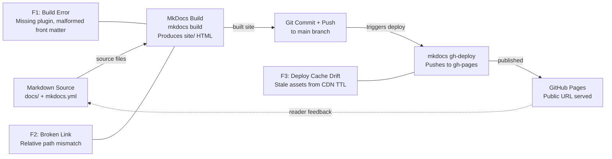

# The Deploy Pipeline from Source to Live Site

<iframe src="main.html" height="600px" width="100%" scrolling="no" style="border: 1px solid #ddd;"></iframe>

[Run the Deploy Pipeline Flow Fullscreen](./main.html){ .md-button .md-button--primary }

## About This MicroSim

A Mermaid flowchart LR diagram with five stages from left to right: Markdown Source, MkDocs Build, Git Commit and Push, mkdocs gh-deploy, and GitHub Pages. Three failure-mode callouts (in red) attach to the stages where they originate: F1 (Build Error) and F2 (Broken Link) at the MkDocs Build stage, F3 (Deploy Cache Drift) at the gh-deploy and GitHub Pages stages. A dashed feedback arrow from GitHub Pages back to Markdown Source signals that deployment starts the next iteration.

## Diagram Details

## Related Resources

- [Chapter 15: Capstone and Deployment](../../chapters/15-capstone-deployment/index.md)
