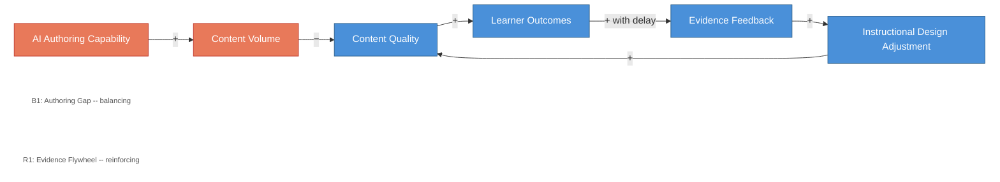

# The Evidence Loop That Disciplines AI-Generated Content

<iframe src="main.html" height="600px" width="100%" scrolling="no" style="border: 1px solid #ddd;"></iframe>

[Run the Evidence Loop Fullscreen](./main.html){ .md-button .md-button--primary }

## About This MicroSim

This causal loop diagram shows two opposing dynamics in AI-assisted textbook authoring. The balancing loop B1 (Authoring Gap) shows how more capable AI produces more content volume, which without a filter dilutes quality. The reinforcing loop R1 (Evidence Flywheel) shows how learner outcomes produce evidence feedback that drives instructional design adjustments, which in turn lift content quality. The delay marker on the outcomes-to-evidence edge reflects the weeks-to-months needed for outcome data to accumulate.

## Diagram Details

## Related Resources

- [Chapter 1: Foundations of Learning Sciences](../../chapters/01-foundations/index.md)
