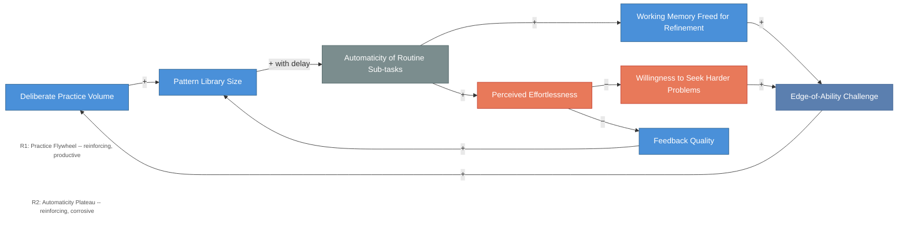

# Expertise Dynamics -- Practice Flywheel and Automaticity Plateau

<iframe src="main.html" height="600px" width="100%" scrolling="no" style="border: 1px solid #ddd;"></iframe>

[Run the Expertise Dynamics Diagram Fullscreen](./main.html){ .md-button .md-button--primary }

## About This MicroSim

This causal loop diagram shows two reinforcing loops in skill acquisition. R1 (Practice Flywheel) is the productive loop: deliberate practice builds the pattern library, which automatizes routine sub-tasks (with delay), which frees working memory for refinement, which makes edge-of-ability challenges tractable, which drives more deliberate practice. R2 (Automaticity Plateau) is the corrosive loop: automaticity produces perceived effortlessness, which reduces willingness to seek harder problems and suppresses informative feedback -- the classic intermediate plateau where many learners stop improving. Edge-of-ability challenge is the pivot variable that determines which loop dominates.

## Diagram Details

## Related Resources

- [Chapter 7: Expertise and Mastery](../../chapters/07-expertise-mastery/index.md)
