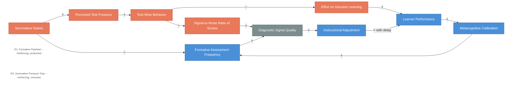

# Feedback Dynamics -- Formative Flywheel vs. Summative Pressure Trap

<iframe src="main.html" height="600px" width="100%" scrolling="no" style="border: 1px solid #ddd;"></iframe>

[Run the Feedback Dynamics Diagram Fullscreen](./main.html){ .md-button .md-button--primary }

## About This MicroSim

This causal loop diagram shows two reinforcing loops in assessment design. R1 (Formative Flywheel) is the productive loop: frequent formative checks produce sharp diagnostic signals, which drive instructional adjustments, which raise learner performance (with delay), which improves metacognitive calibration, which motivates more formative checks. R2 (Summative Pressure Trap) is the corrosive loop: high summative stakes raise perceived pressure, which produces test-wise behavior (cramming, cue-matching), which crowds out genuine learning and degrades the signal-to-noise ratio of scores -- this is Goodhart's Law rendered as a loop. Diagnostic signal quality is the shared pivot variable.

## Diagram Details

## Related Resources

- [Chapter 8: Measurement and Feedback](../../chapters/08-measurement-feedback/index.md)
