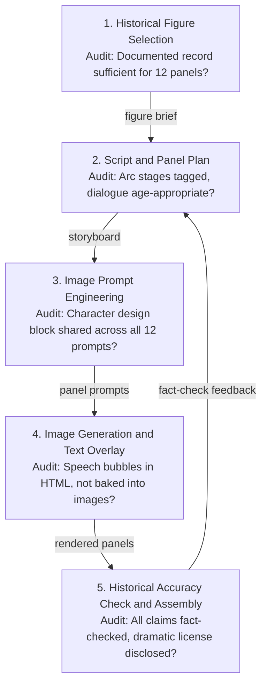

# The Graphic Novel Production Pipeline

<iframe src="main.html" height="600px" width="100%" scrolling="no" style="border: 1px solid #ddd;"></iframe>

[Run the Graphic Novel Pipeline Fullscreen](./main.html){ .md-button .md-button--primary }

## About This MicroSim

A Mermaid flowchart TD diagram showing the five-step graphic-novel production pipeline. Each step is a node annotated with its audit gate question. Inter-step arrows are labeled with the artifact that carries forward: figure brief, storyboard, panel prompts, and rendered panels. An audit feedback arrow from the Historical Accuracy Check back to the Script and Panel Plan step (in orange) signals that fact-check flags may require script revision.

## Diagram Details

## Related Resources

- [Chapter 13: Graphic Novels and Short-Form Stories](../../chapters/13-graphic-novels/index.md)
