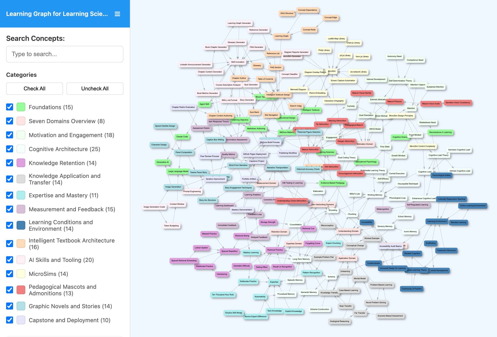

# List of MicroSims for Learning Sciences

Interactive Micro Simulations to help students learn Learning Sciences fundamentals.

-   **[Aggregate Quality-Metrics Dashboard (Synthetic)](./aggregate-quality-dashboard/index.md)**

    Aggregate Quality-Metrics Dashboard (Synthetic)

-   **[Analogical Mapping Explorer](./analogical-mapping-explorer/index.md)**

    Analogical Mapping Explorer

-   **[ARCS as a Four-Pillar Design Audit](./arcs-four-pillars/index.md)**

    ARCS as a Four-Pillar Design Audit

-   **[The Authoring Pipeline — Prompt to Published Site](./authoring-pipeline-architecture/index.md)**

    The Authoring Pipeline — Prompt to Published Site

-   **[Authoring Pipeline Dynamics — Graph-Quality Flywheel vs. Token-Pressure Trap](./authoring-pipeline-dynamics/index.md)**

    Authoring Pipeline Dynamics — Graph-Quality Flywheel vs. Token-Pressure Trap

-   **[The Authoring Pipeline in Motion](./authoring-pipeline-walkthrough/index.md)**

    The Authoring Pipeline in Motion

-   **[Baddeley's Working-Memory Components](./baddeley-working-memory/index.md)**

    Baddeley's Working-Memory Components

-   **[The Barnett and Ceci Transfer Taxonomy](./barnett-ceci-transfer-taxonomy/index.md)**

    The Barnett and Ceci Transfer Taxonomy

-   **[Bjork's Storage Dynamics — Flywheel and Ease Trap](./bjork-storage-dynamics/index.md)**

    Bjork's Storage Dynamics — Flywheel and Ease Trap

-   **[The Seven Bloom Poses and When to Use Each](./bloom-poses-gallery/index.md)**

    The Seven Bloom Poses and When to Use Each

-   **[Interactive Bloom's Taxonomy Pyramid](./bloom-taxonomy-pyramid/index.md)**

    Interactive Bloom's Taxonomy Pyramid

-   **[The Interactive Capstone Rubric](./capstone-rubric-board/index.md)**

    The Interactive Capstone Rubric

-   **[Chunking — Novice vs. Expert Board Recall](./chunking-board-recall/index.md)**

    Chunking — Novice vs. Expert Board Recall

-   **[Chunking Demonstration](./chunking-demonstration/index.md)**

    Chunking Demonstration

-   **[The Cognitive Load Budget](./cognitive-load-budget/index.md)**

    The Cognitive Load Budget

-   **[A Small Learning Graph, Its Topological Ordering, and Its Transitive Reduction](./dag-topological-reduction/index.md)**

    A Small Learning Graph, Its Topological Ordering, and Its Transitive Reduction

-   **[The Deploy Pipeline from Source to Live Site](./deploy-pipeline-flow/index.md)**

    The Deploy Pipeline from Source to Live Site

-   **[Interactive Dreyfus Five-Stage Skill Model](./dreyfus-skill-model/index.md)**

    Interactive Dreyfus Five-Stage Skill Model

-   **[The Evidence Loop That Disciplines AI-Generated Content](./evidence-loop-authoring/index.md)**

    The Evidence Loop That Disciplines AI-Generated Content

-   **[Expertise Dynamics — Practice Flywheel and Automaticity Plateau](./expertise-flywheel-plateau/index.md)**

    Expertise Dynamics — Practice Flywheel and Automaticity Plateau

-   **[Feedback Dynamics — Formative Flywheel vs. Summative Pressure Trap](./feedback-flywheel-pressure-trap/index.md)**

    Feedback Dynamics — Formative Flywheel vs. Summative Pressure Trap

-   **[The Flow Channel — Challenge vs. Skill](./flow-channel-explorer/index.md)**

    The Flow Channel — Challenge vs. Skill

-   **[The Forgetting Curve Simulator](./forgetting-curve-simulator/index.md)**

    The Forgetting Curve Simulator

-   **[A Learning Graph for Learning Sciences](./graph-viewer/index.md)**

    

    A learning graph visualization for a 221 element learning concept graph with 340 concept dependencies for the emerging field of Learning Sciences

-   **[The Graphic Novel Production Pipeline](./graphic-novel-pipeline/index.md)**

    The Graphic Novel Production Pipeline

-   **[Intelligent Textbook Component Architecture (Level 2)](./intelligent-textbook-architecture/index.md)**

    Intelligent Textbook Component Architecture (Level 2)

-   **[Components of an Intelligent Textbook](./intelligent-textbook-components/index.md)**

    Components of an Intelligent Textbook

-   **[IRT Ability-vs-Difficulty Explorer](./irt-ability-difficulty-explorer/index.md)**

    IRT Ability-vs-Difficulty Explorer

-   **[The Iteration Flywheel](./iteration-flywheel/index.md)**

    The Iteration Flywheel

-   **[Three Nested Layers of a Learning Environment](./learning-environment-nested-layers/index.md)**

    Three Nested Layers of a Learning Environment

-   **[Parent Disciplines of Learning Sciences](./learning-sciences-confluence/index.md)**

    Parent Disciplines of Learning Sciences

-   **[Leitner Box Simulator](./leitner-box-simulator/index.md)**

    Leitner Box Simulator

-   **[Which Library Should I Use for This Visualization?](./library-decision-tree/index.md)**

    Which Library Should I Use for This Visualization?

-   **[Load Dynamics — The Extraneous Brake and the Germane Flywheel](./load-dynamics-loops/index.md)**

    Load Dynamics — The Extraneous Brake and the Germane Flywheel

-   **[The Mascot Design Pipeline](./mascot-design-pipeline/index.md)**

    The Mascot Design Pipeline

-   **[Path Depth for the Mascot Image `src`](./mascot-path-depth/index.md)**

    Path Depth for the Mascot Image `src`

-   **[Voice-Consistency Dynamics — Flywheel and Drift Trap](./mascot-voice-consistency-loops/index.md)**

    Voice-Consistency Dynamics — Flywheel and Drift Trap

-   **[Mental-Model Probe Interview Flow](./mental-model-probe-interview/index.md)**

    Mental-Model Probe Interview Flow

-   **[Control Complexity Dynamics — The Scaffolded-Exploration Flywheel and the Cognitive-Overload Trap](./microsim-control-complexity-loops/index.md)**

    Control Complexity Dynamics — The Scaffolded-Exploration Flywheel and the Cognitive-Overload Trap

-   **[The Competence Flywheel and the Frustration Brake](./motivation-loops-competence-frustration/index.md)**

    The Competence Flywheel and the Frustration Brake

-   **[The Power-Law Learning Curve](./power-law-learning-curve/index.md)**

    The Power-Law Learning Curve

-   **[Psychological Safety Dynamics — Two Opposed Loops](./psychological-safety-dynamics/index.md)**

    Psychological Safety Dynamics — Two Opposed Loops

-   **[Retrieval Strength vs. Storage Strength](./retrieval-vs-storage-strength/index.md)**

    Retrieval Strength vs. Storage Strength

-   **[Analytic vs. Holistic Rubric — Structure and Signal](./rubric-analytic-vs-holistic/index.md)**

    Analytic vs. Holistic Rubric — Structure and Signal

-   **[Scaffold Fading Progression](./scaffold-fading-trainer/index.md)**

    Scaffold Fading Progression

-   **[Self-Determination Theory — Three Needs as a Venn Overlay](./sdt-three-needs-venn/index.md)**

    Self-Determination Theory — Three Needs as a Venn Overlay

-   **[The Seven Domains as a Coupled System](./seven-domains-coupling/index.md)**

    The Seven Domains as a Coupled System

-   **[The Seven Domains Wheel](./seven-domains-wheel/index.md)**

    The Seven Domains Wheel

-   **[Skill Dependency Graph](./skill-dependency-graph/index.md)**

    Skill Dependency Graph

-   **[The Skill-Quality Flywheel](./skill-quality-flywheel/index.md)**

    The Skill-Quality Flywheel

-   **[Slide Viewer](./slide-viewer/index.md)**

    A lightweight slide viewer for Markdown slide decks authored as MkDocs pages. Pass the rendered page URL of a `slides.md` file via the `?src=` query parameter and the viewer fetches the built HTML, sp

-   **[Spaced Retrieval Schedule Timeline](./spaced-retrieval-timeline/index.md)**

    Spaced Retrieval Schedule Timeline

-   **[Talk-Moves Decision Tree for Classroom Discourse](./talk-moves-decision-tree/index.md)**

    Talk-Moves Decision Tree for Classroom Discourse

-   **[The Textbook Production Pipeline](./textbook-production-pipeline/index.md)**

    The Textbook Production Pipeline

-   **[The Three-Stage Memory Model](./three-stage-memory-model/index.md)**

    The Three-Stage Memory Model

-   **[Token Budget Explorer](./token-budget-explorer/index.md)**

    Token Budget Explorer

-   **[Transfer Dynamics — Schema Flywheel and Surface-Match Trap](./transfer-dynamics-flywheel-trap/index.md)**

    Transfer Dynamics — Schema Flywheel and Surface-Match Trap

-   **[Transportation Dynamics — Identification Flywheel and Accuracy-Erosion Trap](./transportation-dynamics-loops/index.md)**

    Transportation Dynamics — Identification Flywheel and Accuracy-Erosion Trap

-   **[The Twelve-Panel Story Arc Map](./twelve-panel-arc-map/index.md)**

    The Twelve-Panel Story Arc Map

-   **[UDL Three Principles with Checkable Representation Examples](./udl-three-principles/index.md)**

    UDL Three Principles with Checkable Representation Examples

-   **[Zimmerman's Self-Regulated Learning Cycle](./zimmerman-srl-cycle/index.md)**

    Zimmerman's Self-Regulated Learning Cycle

-   **[The Zone of Proximal Development as Three Concentric Zones](./zpd-three-zones/index.md)**

    The Zone of Proximal Development as Three Concentric Zones

