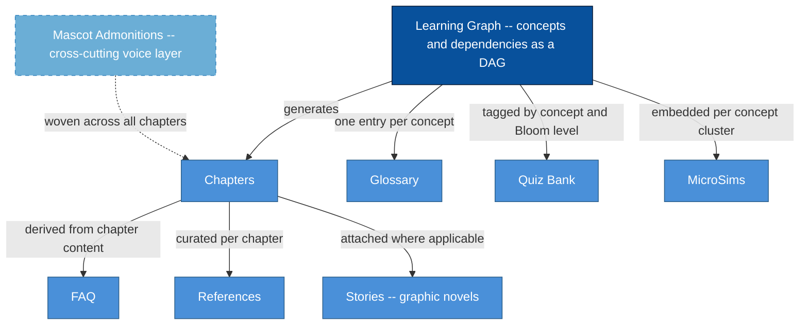

# Components of an Intelligent Textbook

<iframe src="main.html" height="600px" width="100%" scrolling="no" style="border: 1px solid #ddd;"></iframe>

[Run the Components of an Intelligent Textbook Fullscreen](./main.html){ .md-button .md-button--primary }

## About This MicroSim

This diagram shows how the Learning Graph sits at the center of an intelligent textbook as its structural spine. From the graph, all other artifacts are generated: Chapters, Glossary, Quiz Bank, MicroSims, FAQ, References, and Stories. Mascot Admonitions appear as a cross-cutting voice layer that weaves across all chapters rather than hanging off a single node. Each edge is labeled with the dependency type that connects the artifact to its source.

## Diagram Details

## Related Resources

- [Chapter 1: Foundations of Learning Sciences](../../chapters/01-foundations/index.md)
