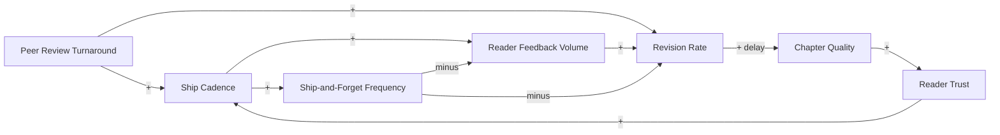

# The Iteration Flywheel

<iframe src="main.html" height="600px" width="100%" scrolling="no" style="border: 1px solid #ddd;"></iframe>

[Run the Iteration Flywheel Fullscreen](./main.html){ .md-button .md-button--primary }

## About This MicroSim

A causal loop diagram with seven variable-nodes and two named loops. **R1 (Iteration flywheel):** Ship cadence produces reader feedback, which seeds revision. Peer review turnaround accelerates revision. Revisions compound into chapter quality, which builds reader trust, enabling more confident shipping. **B1 (Ship-and-forget brake):** Shipping without a feedback gate tempts skipping feedback collection and revision, starving the flywheel. The negative edges from the anti-pattern node are highlighted in red.

## Diagram Details

## Related Resources

- [Chapter 15: Capstone and Deployment](../../chapters/15-capstone-deployment/index.md)
