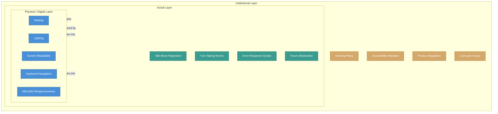

# Three Nested Layers of a Learning Environment

<iframe src="main.html" height="700px" width="100%" scrolling="no" style="border: 1px solid #ddd;"></iframe>

[Run the Nested Layers Diagram Fullscreen](./main.html){ .md-button .md-button--primary }

## About This MicroSim

This diagram uses nested subgraphs to show the three concentric layers of a learning environment. The innermost layer (Physical/Digital) contains design levers like seating, lighting, screen readability, and MicroSim responsiveness. The middle layer (Social) contains talk-move repertoire, turn-taking norms, error-response scripts, and forum moderation. The outermost layer (Institutional) contains grading policy, accessibility mandates, privacy regulation, and curricular scope. Arrows between layers show both upward influence (physical choices shape the social layer) and downward influence (institutional mandates cascade into social norms and physical features).

## Diagram Details

## Related Resources

- [Chapter 9: Learning Conditions and Environment](../../chapters/09-learning-conditions/index.md)
