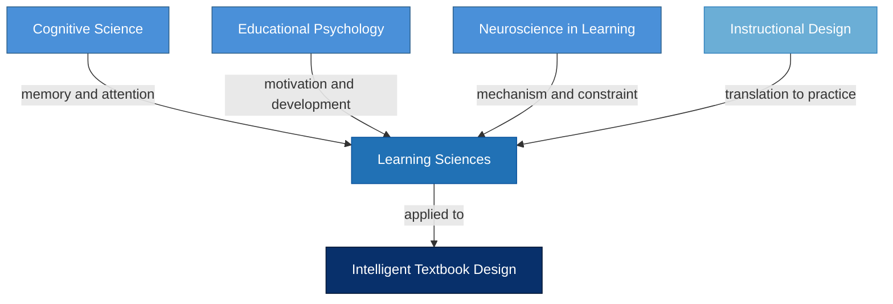

# Parent Disciplines of Learning Sciences

<iframe src="main.html" height="600px" width="100%" scrolling="no" style="border: 1px solid #ddd;"></iframe>

[Run the Parent Disciplines of Learning Sciences Fullscreen](./main.html){ .md-button .md-button--primary }

## About This MicroSim

This diagram shows how Learning Sciences draws from four parent disciplines. Three research disciplines -- Cognitive Science, Educational Psychology, and Neuroscience in Learning -- sit on the top row. Instructional Design serves as the translation layer between research and practice. All four converge on Learning Sciences, which in turn feeds into Intelligent Textbook Design. Each arrow is labeled with the primary contribution that discipline makes.

## Diagram Details

## Related Resources

- [Chapter 1: Foundations of Learning Sciences](../../chapters/01-foundations/index.md)
