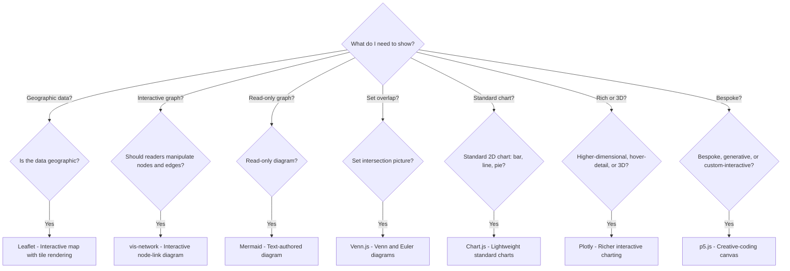

# Which Library Should I Use for This Visualization?

<iframe src="main.html" height="700px" width="100%" scrolling="no" style="border: 1px solid #ddd;"></iframe>

[Run the Library Decision Tree Fullscreen](./main.html){ .md-button .md-button--primary }

## About This MicroSim

A Mermaid flowchart TD decision tree starting from the root question "What do I need to show?" with seven branches, each routing to one of the project's visualization libraries: Leaflet for geographic data, vis-network for interactive node-link graphs, Mermaid for read-only diagrams, Venn.js for set intersections, Chart.js for standard 2D charts, Plotly for higher-dimensional or 3D data, and p5.js for bespoke or generative visualizations. Each leaf is colored by library.

## Diagram Details

## Related Resources

- [Chapter 11: MicroSims and Interactive Visualizations](../../chapters/11-microsims/index.md)
