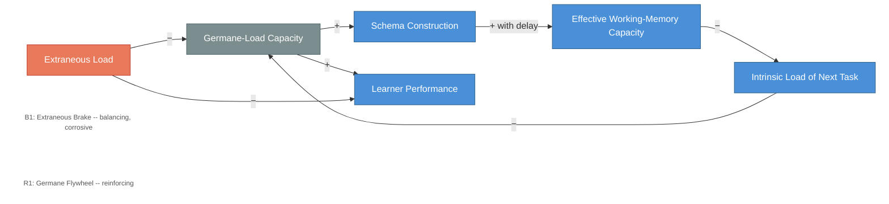

# Load Dynamics -- The Extraneous Brake and the Germane Flywheel

<iframe src="main.html" height="600px" width="100%" scrolling="no" style="border: 1px solid #ddd;"></iframe>

[Run the Load Dynamics Diagram Fullscreen](./main.html){ .md-button .md-button--primary }

## About This MicroSim

This causal loop diagram shows two opposing dynamics in cognitive load theory. B1 (Extraneous Brake) shows how extraneous load crowds out germane-load capacity, weakening schema construction, which keeps effective capacity low and intrinsic load high -- a design-quality failure that compounds. R1 (Germane Flywheel) shows the productive loop: germane-load capacity drives schema construction, schemas enable chunking that expands effective working-memory capacity, lower intrinsic load frees more germane capacity, and the cycle accelerates. Germane-load capacity is the shared pivot node where both loops compete.

## Diagram Details

## Related Resources

- [Chapter 4: Cognitive Architecture and Load](../../chapters/04-cognitive-architecture/index.md)
