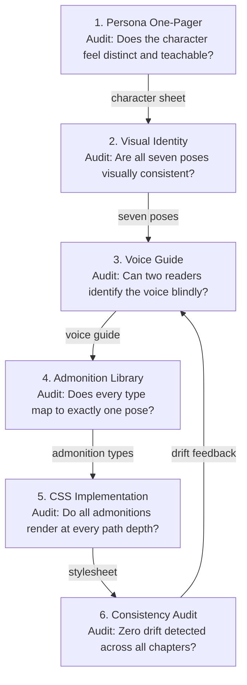

# The Mascot Design Pipeline

<iframe src="main.html" height="600px" width="100%" scrolling="no" style="border: 1px solid #ddd;"></iframe>

[Run the Mascot Design Pipeline Fullscreen](./main.html){ .md-button .md-button--primary }

## About This MicroSim

A Mermaid flowchart TD diagram showing the six-step mascot design procedure as a pipeline. Each step is a node annotated with its audit gate question. Inter-step arrows are labeled with the artifact that carries forward: character sheet, seven poses, voice guide, admonition types, and stylesheet. An audit feedback arrow from the Consistency Audit back to the Voice Guide step (in orange) shows that the pipeline is a loop, not a dead end -- drift detected in the audit triggers voice guide strengthening.

## Diagram Details

## Related Resources

- [Chapter 12: Pedagogical Mascots and Admonitions](../../chapters/12-mascots-admonitions/index.md)
