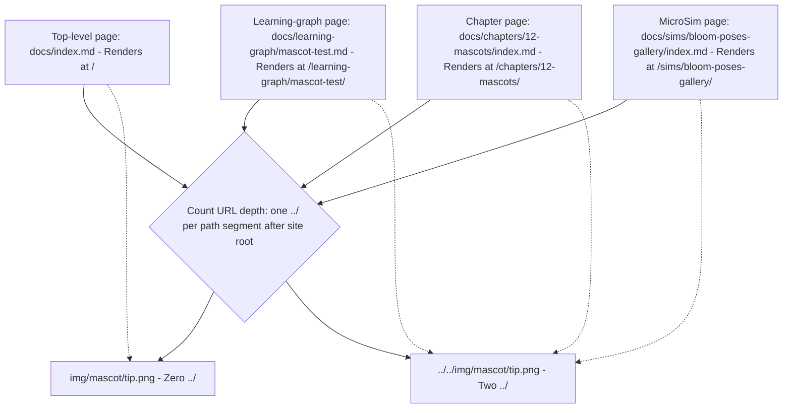

# Path Depth for the Mascot Image src

<iframe src="main.html" height="600px" width="100%" scrolling="no" style="border: 1px solid #ddd;"></iframe>

[Run the Mascot Path Depth Diagram Fullscreen](./main.html){ .md-button .md-button--primary }

## About This MicroSim

A Mermaid flowchart TD diagram showing four representative page locations and the relative path each must use for the mascot image. Page nodes (in blue) connect to a central decision node (in amber) that states the rule: one `../` per URL path segment after the site root. Correct path nodes are shown in green. A failure-mode callout (in red) warns that too few `../` produces a broken image with no build-log warning -- a silent footgun.

## Diagram Details

## Related Resources

- [Chapter 12: Pedagogical Mascots and Admonitions](../../chapters/12-mascots-admonitions/index.md)
