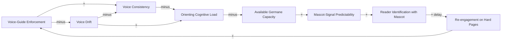

# Voice-Consistency Dynamics - Flywheel and Drift Trap

<iframe src="main.html" height="600px" width="100%" scrolling="no" style="border: 1px solid #ddd;"></iframe>

[Run the Voice-Consistency Dynamics Fullscreen](./main.html){ .md-button .md-button--primary }

## About This MicroSim

A causal loop diagram with eight variable-nodes and two named loops. **R1 (Voice-consistency flywheel):** Enforcement builds consistency, which lowers orienting cognitive load, freeing germane capacity to notice mascot signals, strengthening reader identification, driving re-engagement, which reinforces enforcement. **B1 (Voice-drift trap):** Drift erodes consistency, raises orienting load, crowds germane capacity, muddling signals and weakening identification -- a corrosive reinforcing loop running in the bad direction. The shared variable "Voice Consistency" belongs to both loops.

## Diagram Details

## Related Resources

- [Chapter 12: Pedagogical Mascots and Admonitions](../../chapters/12-mascots-admonitions/index.md)
