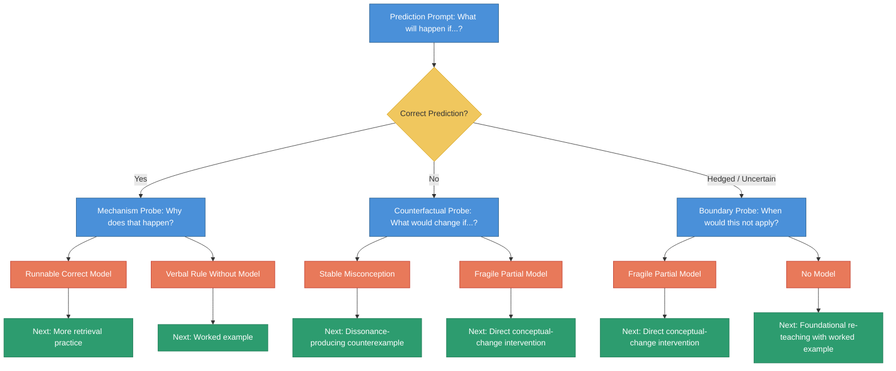

# Mental-Model Probe Interview Flow

<iframe src="main.html" height="700px" width="100%" scrolling="no" style="border: 1px solid #ddd;"></iframe>

[Run the Mental-Model Probe Interview Fullscreen](./main.html){ .md-button .md-button--primary }

## About This MicroSim

This flowchart shows a branching interview protocol for diagnosing a learner's mental model. It starts with a prediction prompt, then branches based on the learner's answer -- correct, incorrect, or hedged -- into follow-up probes (mechanism, counterfactual, or boundary). Each branch leads to a diagnostic label (runnable correct model, verbal rule without model, stable misconception, fragile partial model, or no model) and a recommended next instructional move. Blue nodes are prompts, yellow diamonds are decisions, orange nodes are diagnostic labels, and green nodes are recommended actions.

## Diagram Details

## Related Resources

- [Chapter 6: Application and Transfer](../../chapters/06-application-transfer/index.md)
