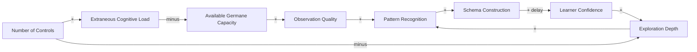

# Control Complexity Dynamics - Scaffolded-Exploration Flywheel and Cognitive-Overload Trap

<iframe src="main.html" height="600px" width="100%" scrolling="no" style="border: 1px solid #ddd;"></iframe>

[Run the Control Complexity Dynamics Fullscreen](./main.html){ .md-button .md-button--primary }

## About This MicroSim

A causal loop diagram with eight variable-nodes and two named loops. **R1 (Scaffolded-exploration flywheel):** When control count stays tight, available germane capacity feeds observation quality, pattern recognition, schema construction, learner confidence, and exploration depth -- a reinforcing productive loop. **B1 (Cognitive-overload trap):** Too many controls raise extraneous cognitive load, crowd out germane capacity, and freeze exploration. The shared node "Available Germane Capacity" belongs to both loops.

## Diagram Details

## Related Resources

- [Chapter 11: MicroSims and Interactive Visualizations](../../chapters/11-microsims/index.md)
