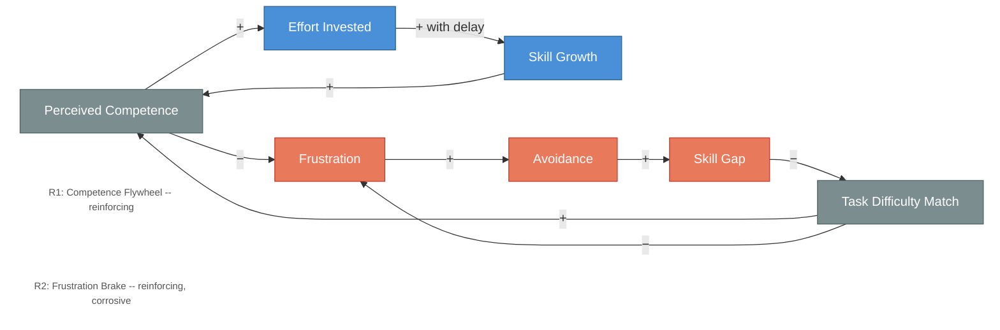

# The Competence Flywheel and the Frustration Brake

<iframe src="main.html" height="600px" width="100%" scrolling="no" style="border: 1px solid #ddd;"></iframe>

[Run the Competence Flywheel Diagram Fullscreen](./main.html){ .md-button .md-button--primary }

## About This MicroSim

This causal loop diagram shows two reinforcing loops that compete for control of learner motivation. R1 (Competence Flywheel) is the productive loop: perceived competence fuels effort, effort produces skill growth (with delay), and skill growth raises perceived competence. R2 (Frustration Brake) is the corrosive loop: frustration drives avoidance, avoidance widens the skill gap, and a larger gap makes the next task feel harder, which produces more frustration. Perceived competence and task difficulty match are shared nodes that connect the two loops -- they determine which loop dominates.

## Diagram Details

## Related Resources

- [Chapter 3: Motivation and Engagement](../../chapters/03-motivation-engagement/index.md)
