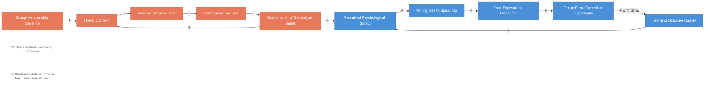

# Psychological Safety Dynamics -- Two Opposed Loops

<iframe src="main.html" height="600px" width="100%" scrolling="no" style="border: 1px solid #ddd;"></iframe>

[Run the Psychological Safety Dynamics Diagram Fullscreen](./main.html){ .md-button .md-button--primary }

## About This MicroSim

This causal loop diagram shows two opposing reinforcing loops. R1 (Safety Flywheel) is the productive loop: perceived psychological safety increases willingness to speak up, which exposes errors in discourse, which creates group error-correction opportunities, which raises learning outcome quality (with delay), which reinforces the belief that speaking up pays off. R2 (Threat-Load-Underperformance Trap) is the corrosive loop: group-membership salience raises threat concern, which loads working memory, which lowers performance, which confirms stereotype beliefs, which raises more threat concern. The cross-link from confirmation of stereotype belief to perceived psychological safety (negative) shows how the corrosive loop starves the productive one.

## Diagram Details

## Related Resources

- [Chapter 9: Learning Conditions and Environment](../../chapters/09-learning-conditions/index.md)
