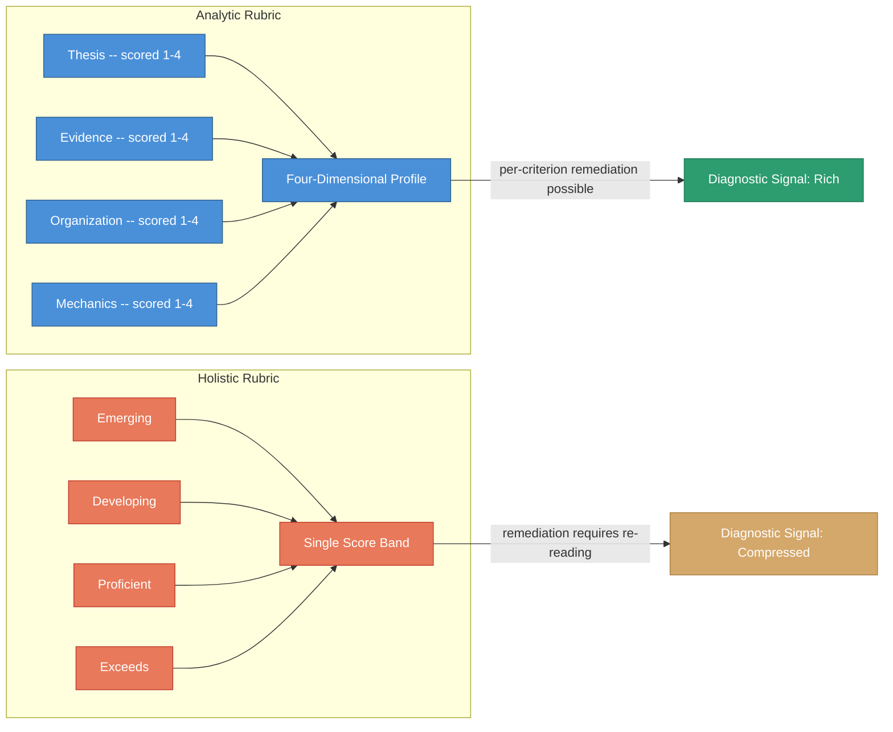

# Analytic vs. Holistic Rubric -- Structure and Signal

<iframe src="main.html" height="600px" width="100%" scrolling="no" style="border: 1px solid #ddd;"></iframe>

[Run the Rubric Comparison Diagram Fullscreen](./main.html){ .md-button .md-button--primary }

## About This MicroSim

This diagram compares two rubric structures side by side. The left panel shows an analytic rubric for a writing assignment with four independent criteria (Thesis, Evidence, Organization, Mechanics), each scored 1-4, feeding a four-dimensional profile chart that enables per-criterion remediation. The right panel shows a holistic rubric with four performance-level bands (Emerging, Developing, Proficient, Exceeds) feeding a single score. Neither is universally better -- the choice depends on whether you need per-dimension remediation (analytic) or time-efficient end-of-course judgment (holistic).

## Diagram Details

## Related Resources

- [Chapter 8: Measurement and Feedback](../../chapters/08-measurement-feedback/index.md)
