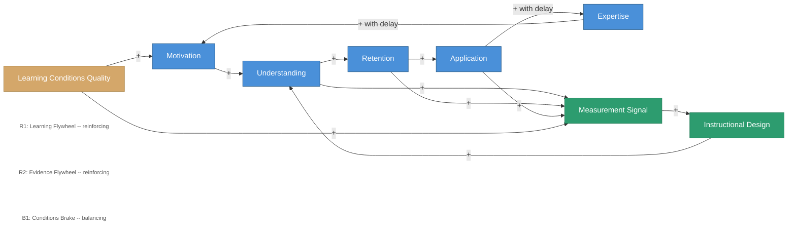

# The Seven Domains as a Coupled System

<iframe src="main.html" height="600px" width="100%" scrolling="no" style="border: 1px solid #ddd;"></iframe>

[Run the Seven Domains Coupling Diagram Fullscreen](./main.html){ .md-button .md-button--primary }

## About This MicroSim

This causal loop diagram shows how the seven domains of learning science form a coupled system. The forward chain R1 (Learning Flywheel) traces motivation through understanding, retention, application, and expertise, with expertise feeding back into motivation. The R2 loop (Evidence Flywheel) shows how understanding, retention, and application produce measurement signals that drive instructional design adjustments. Learning Conditions Quality acts as a substrate that lifts both motivation and measurement signal quality. Delay markers appear on the application-to-expertise and expertise-to-motivation edges to reflect the long latency of those transitions.

## Diagram Details

## Related Resources

- [Chapter 2: The Seven Domains Framework](../../chapters/02-seven-domains/index.md)
