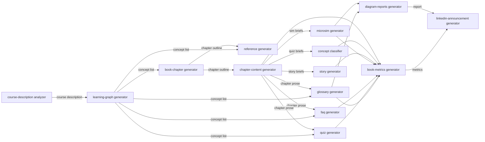

# Skill Dependency Graph

<iframe src="main.html" height="700px" width="100%" scrolling="no" style="border: 1px solid #ddd;"></iframe>

[Run the Skill Dependency Graph Fullscreen](./main.html){ .md-button .md-button--primary }

## About This MicroSim

A Mermaid flowchart LR diagram showing all fourteen agent skills as nodes, with edges where one skill's output is a required input of another. The learning-graph-generator sits as a central hub (warm orange) with outgoing edges to book-chapter-generator, glossary-generator, quiz-generator, faq-generator, and reference-generator. Skills are color-coded by category: foundation (blue), authoring (teal), derived (green), engagement (amber), and audit (orange). Edges are labeled with the carrying artifact type.

## Diagram Details

## Related Resources

- [Chapter 14: AI Agent Skills for Textbook Generation](../../chapters/14-agent-skills/index.md)
