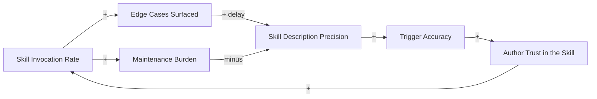

# The Skill-Quality Flywheel

<iframe src="main.html" height="600px" width="100%" scrolling="no" style="border: 1px solid #ddd;"></iframe>

[Run the Skill-Quality Flywheel Fullscreen](./main.html){ .md-button .md-button--primary }

## About This MicroSim

A causal loop diagram with six variable-nodes and one named reinforcing loop. **R1 (Skill-quality flywheel):** Invocation surfaces edge cases, which tighten the skill description, improving trigger accuracy and author trust, which drives more invocation. Each trip around makes the next easier. Maintenance burden (in orange) is the drag variable that can stall the loop if left unattended -- its negative edge into description precision is highlighted in red.

## Diagram Details

## Related Resources

- [Chapter 14: AI Agent Skills for Textbook Generation](../../chapters/14-agent-skills/index.md)
