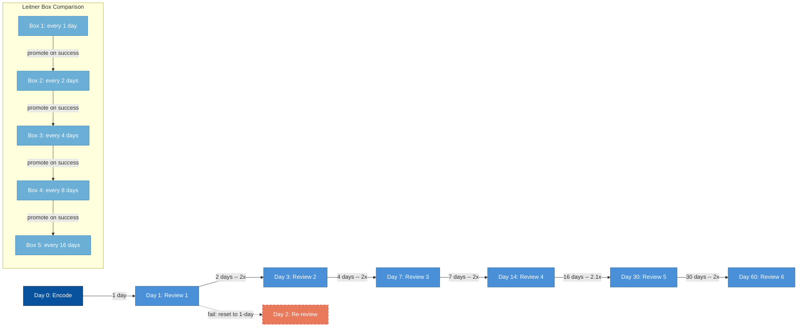

# Spaced Retrieval Schedule Timeline

<iframe src="main.html" height="700px" width="100%" scrolling="no" style="border: 1px solid #ddd;"></iframe>

[Run the Spaced Retrieval Timeline Fullscreen](./main.html){ .md-button .md-button--primary }

## About This MicroSim

This diagram shows a single flashcard's review schedule across a 60-day window using the SM-2 expanding interval pattern. Initial encoding at day 0, then reviews at days 1, 3, 7, 14, 30, and 60. Each interval is annotated with its ratio to the previous interval, showing how the ratio approaches a constant as the schedule matures. A failed review resets the card to a 1-day interval (shown as a dashed track). A Leitner box comparison shows the alternative promotion-based schedule for reference.

## Diagram Details

## Related Resources

- [Chapter 5: Knowledge Retention](../../chapters/05-knowledge-retention/index.md)
