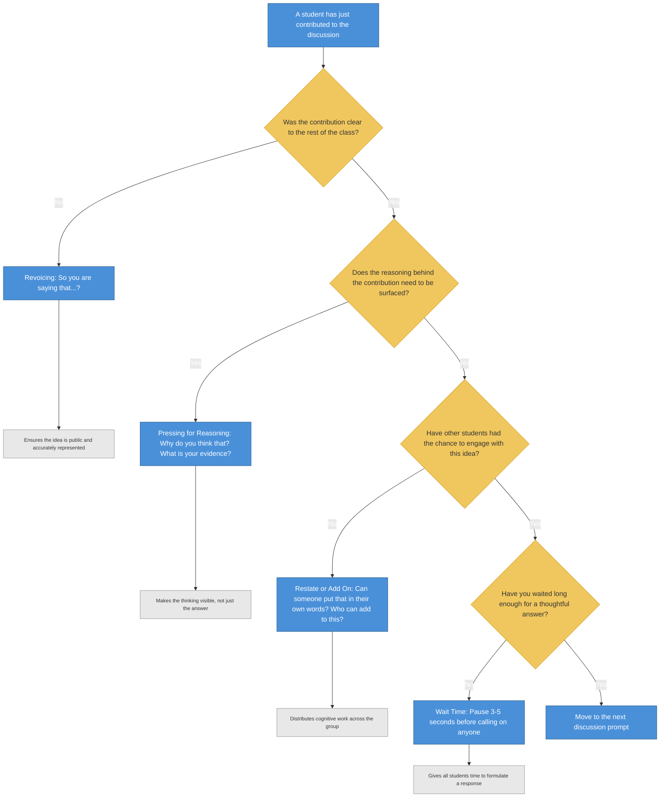

# Talk-Moves Decision Tree for Classroom Discourse

<iframe src="main.html" height="800px" width="100%" scrolling="no" style="border: 1px solid #ddd;"></iframe>

[Run the Talk-Moves Decision Tree Fullscreen](./main.html){ .md-button .md-button--primary }

## About This MicroSim

This decision tree helps instructors choose the right talk move after a student contribution. It branches through four questions: Was the contribution clear? Does the reasoning need to be surfaced? Have other students engaged? Have you waited long enough? Each branch leads to a specific accountable-talk move -- Revoicing, Pressing for Reasoning, Restating/Adding On, or Wait Time -- with a sample teacher prompt and a note on the cognitive work the move is doing. Yellow diamonds are decision points, blue nodes are talk moves, and gray nodes explain the purpose.

## Diagram Details

## Related Resources

- [Chapter 9: Learning Conditions and Environment](../../chapters/09-learning-conditions/index.md)
