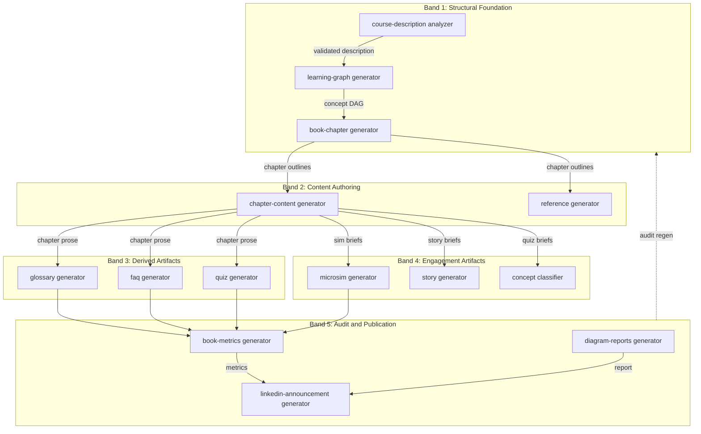

# The Textbook Production Pipeline

<iframe src="main.html" height="800px" width="100%" scrolling="no" style="border: 1px solid #ddd;"></iframe>

[Run the Textbook Production Pipeline Fullscreen](./main.html){ .md-button .md-button--primary }

## About This MicroSim

A Mermaid flowchart TD diagram arranged in five horizontal bands from top (structural skills) to bottom (publication skills). Band 1 (blue): course-description-analyzer, learning-graph-generator, book-chapter-generator. Band 2 (teal): chapter-content-generator, reference-generator. Band 3 (green): glossary-generator, faq-generator, quiz-generator. Band 4 (amber): microsim-generator, story-generator, concept-classifier. Band 5 (orange): book-metrics-generator, diagram-reports-generator, linkedin-announcement-generator. A dashed feedback arrow from Band 5 back to Band 1 signals that audit findings can trigger a re-run of any earlier stage.

## Diagram Details

## Related Resources

- [Chapter 14: AI Agent Skills for Textbook Generation](../../chapters/14-agent-skills/index.md)
