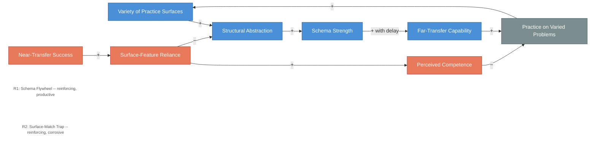

# Transfer Dynamics -- Schema Flywheel and Surface-Match Trap

<iframe src="main.html" height="600px" width="100%" scrolling="no" style="border: 1px solid #ddd;"></iframe>

[Run the Transfer Dynamics Diagram Fullscreen](./main.html){ .md-button .md-button--primary }

## About This MicroSim

This causal loop diagram shows two reinforcing loops that compete for control of transfer capability. R1 (Schema Flywheel) is the productive loop: varied practice surfaces force structural abstraction, which builds schema strength, which enables far-transfer capability (with delay), which motivates more varied practice. R2 (Surface-Match Trap) is the corrosive loop: near-transfer success trains surface-feature reliance, which produces perceived competence that reduces the motivation to seek harder problems, and simultaneously suppresses structural abstraction. Practice on varied problems is the shared pivot node -- the lever that determines which loop dominates.

## Diagram Details

## Related Resources

- [Chapter 6: Application and Transfer](../../chapters/06-application-transfer/index.md)
