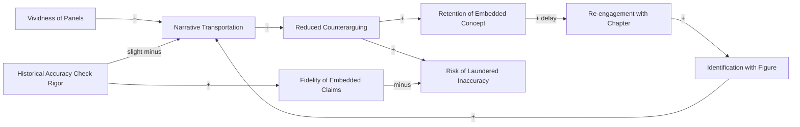

# Transportation Dynamics - Identification Flywheel and Accuracy-Erosion Trap

<iframe src="main.html" height="600px" width="100%" scrolling="no" style="border: 1px solid #ddd;"></iframe>

[Run the Transportation Dynamics Fullscreen](./main.html){ .md-button .md-button--primary }

## About This MicroSim

A causal loop diagram with nine variable-nodes and two named loops. **R1 (Identification flywheel):** Vivid panels and reader identification drive narrative transportation, which reduces counterarguing and improves retention. Re-engagement deepens identification, spinning the productive loop. **B1 (Accuracy-erosion trap):** Transportation also reduces counterarguing against false claims, laundering inaccuracy into retained false beliefs. Historical accuracy check rigor is the brake that keeps fidelity high and risk low. The shared node "Reduced Counterarguing" belongs to both loops.

## Diagram Details

## Related Resources

- [Chapter 13: Graphic Novels and Short-Form Stories](../../chapters/13-graphic-novels/index.md)
