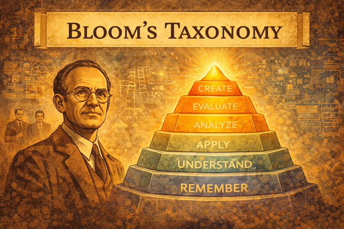
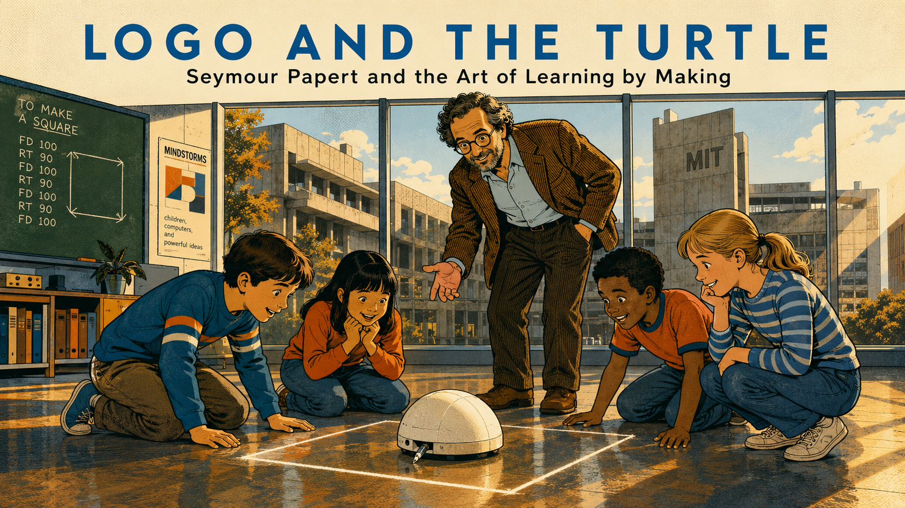

# Stories

These short-form graphic novels bring the history of learning sciences to life. Each story follows a scientist, educator, or innovator whose discoveries directly shaped how we understand learning — and how we design intelligent textbooks today.

Stories are 8 to 12 illustrated panels with narrative text. Each one connects to specific chapters and concepts in the book, so you can return to a story after reading the relevant chapter and see the theory in its human context.

Browse the [Story Ideas](story-ideas.md) page for the full list of planned stories and how to generate them with the `/story-generator` skill.

*One story below links to the [Automating Instructional Design](https://dmccreary.github.io/automating-instructional-design/) site, where the full panels and images are hosted. Use your browser's back button to return here. We link rather than duplicate because each story includes generated panel images — copying them across textbooks adds unnecessary bulk without adding value.*

## Stories

- **[The Story of Bloom's Taxonomy](https://dmccreary.github.io/automating-instructional-design/stories/bloom/)**

    
    How a group of university examiners spent eight years building a shared language for what it means to learn. Bloom's 1956 taxonomy — six levels from remembering to creating — changed how every teacher writes a test.

- **[One Million Nonsense Syllables](./ebbinghaus/index.md)**

    
    Hermann Ebbinghaus memorized thousands of meaningless syllable lists — and tested himself days, weeks, and months later — to discover the exponential forgetting curve and the spacing effect that underlies every spaced-repetition system today.

- **[The Unfinished Symphony](./vygotsky/index.md)**

    
    Lev Vygotsky produced a decade of landmark work on language, thought, and social learning while dying of tuberculosis at 37. His concept of the Zone of Proximal Development transformed instructional design — decades after the Soviet state tried to suppress it.

- **[The Doctor Who Watched Children](./montessori/index.md)**

    
    Italy's first female physician rebuilt an entire classroom — furniture, materials, and all — after watching children in Rome's poorest slum absorb tasks that "shouldn't" have been interesting to them. The environment was the lesson.

- **[Logo and the Turtle](./papert/index.md)**

    
    Seymour Papert saw the computer not as a delivery system for content but as the world's best construction kit. His Logo programming language and the turtle that drew on screen gave children agency over their own learning — and fathered every MicroSim in this textbook.

- **[Banking vs. Dialogue](./freire/index.md)**

    
    Paulo Freire taught Brazilian peasants to read by asking them about their own lives — not by depositing facts into passive learners. The military coup found his method dangerous enough to imprison him. *Pedagogy of the Oppressed* became one of the most cited education texts of the 20th century.

- **[Ganas](./escalante/index.md)**

    
    When Jaime Escalante decided to teach AP Calculus to students everyone had written off at Garfield High in East L.A., the testing company accused them of cheating when they passed. Fourteen students retook the exam. All fourteen passed again.

- **[The Teaching Machine](./skinner/index.md)**

    
    Watching his daughter's arithmetic class in 1954, B. F. Skinner built a wooden box that gave students immediate feedback — one question at a time. Educators dismissed it as mechanical. His two core ideas — immediate feedback and self-paced advancement — survived into every intelligent textbook.

- **[The Personal Dynamic Medium](./alan-kay/index.md)**

    
    In 1972, Alan Kay sketched a notebook-sized computer for children — with a library of interactive simulations — that the technology of the time couldn't build. The Dynabook concept eventually became the tablet. The idea it embodied is still the most radical claim in educational technology.

- **[Sofia's Reckoning](./sofia/index.md)**

    
    Three days before finals, Sofia discovers that three semesters of careful highlighting and re-reading have left her unable to answer questions she *knows* she read. A fictional story about the difference between the feeling of learning and the science of retrieval.

