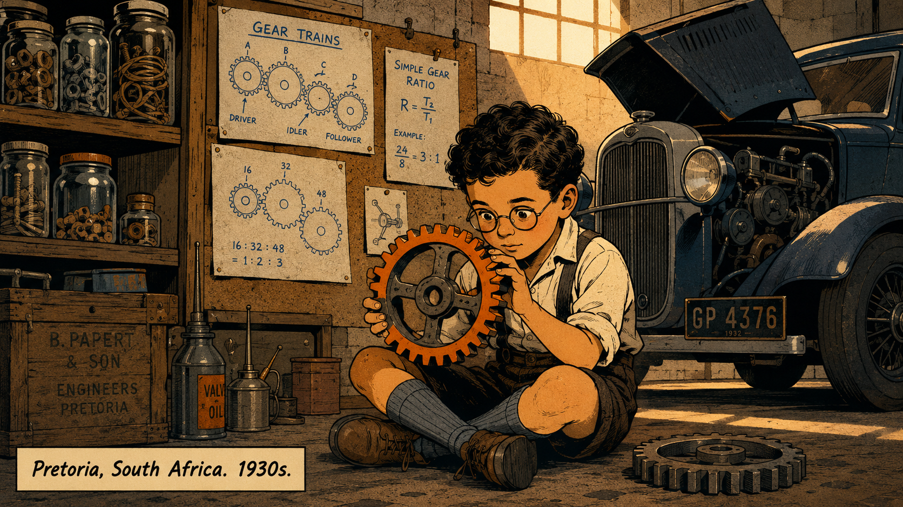
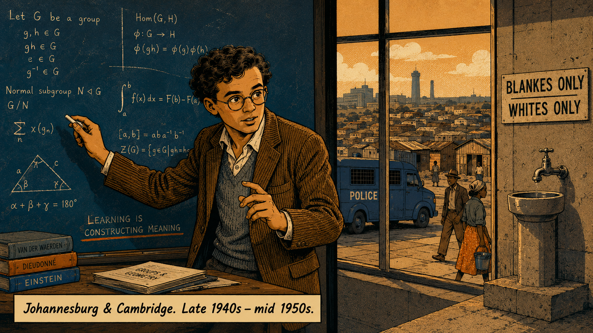
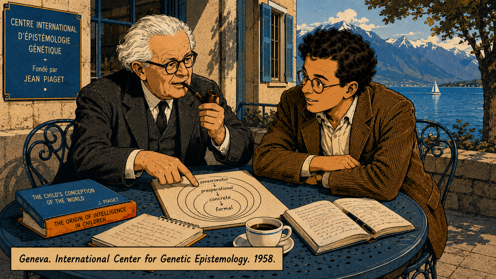
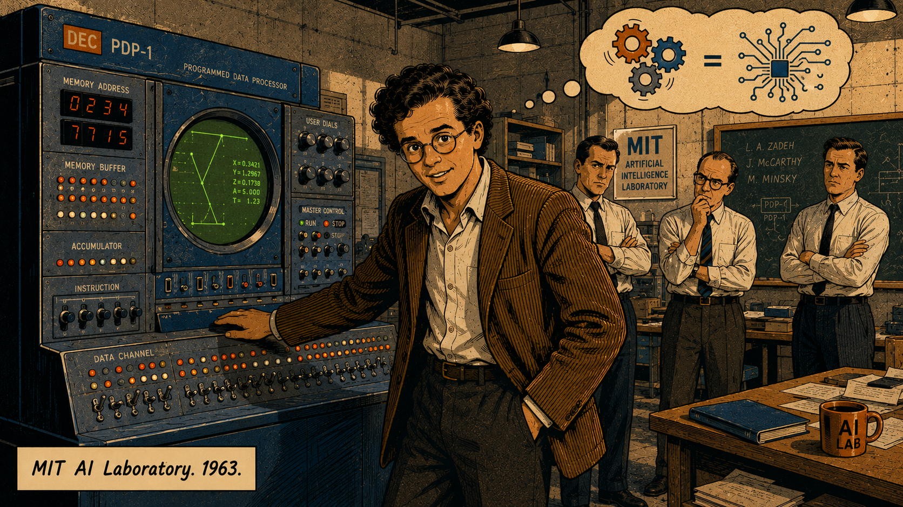
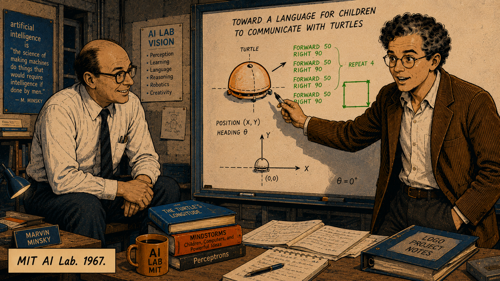
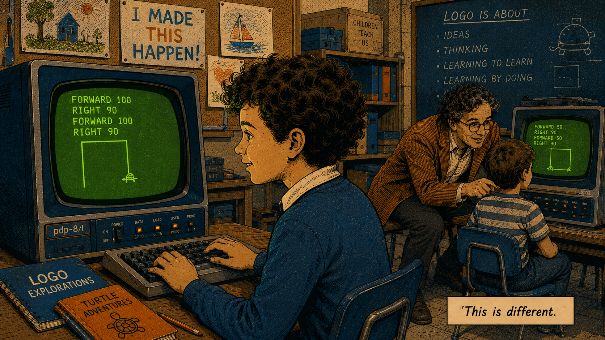

# Logo and the Turtle

## Seymour Papert and the Art of Learning by Making

Cover Image Prompt

(This is the Cover Image. Do not include this label in the image.)
Cover image prompt. Wide landscape format, 16:9 aspect ratio. Mid-Century Modern graphic novel style: clean geometric shapes, flat color areas, IBM blue (#1F70C1) and warm orange (#E8720C) as dominant palette accents, with lime-green terminal glow (#39FF14) used sparingly for the turtle's trail. Strong ink outlines, subtle halftone texture. MIT's brutalist concrete architecture visible through floor-to-ceiling windows in the background, warm afternoon light streaming in at a low angle. Center foreground: a compact dome-shaped floor turtle robot — roughly the size of a large salad bowl, white plastic body, a small pen nib visible at its base — resting on a polished linoleum floor. Behind the robot, a perfect chalk-line square has been drawn on the floor, the lines crisp and geometric. Surrounding the robot, four children (ages 8–11, diverse) are crouched or kneeling, faces tilted down toward the machine with wide-eyed recognition — the unmistakable expression of *I made that happen*. Standing slightly behind the children, one hand loosely in a trouser pocket and the other gesturing toward the square: Seymour Papert. He is a compact man in his early 40s, curly dark hair starting to go grey at the temples, no tie, an open-collar shirt and corduroy jacket, round wire-rimmed glasses, leaning forward with relaxed intensity. The turtle's chalk line catches the afternoon light. Title lettering at top: "LOGO AND THE TURTLE" in clean Mid-Century sans-serif capitals, IBM blue, letter-spaced generously. Subtitle below in smaller weight: "Seymour Papert and the Art of Learning by Making." Generate the image immediately without asking clarifying questions.

---

## Panel 1: Pretoria, 1930s — The Boy and the Gears

Image Prompt

(This is Panel 01. Do not include the panel number in the image.)
Panel 1 of 12. Wide landscape format, 16:9 aspect ratio. Mid-Century Modern graphic novel style: clean geometric shapes, flat color areas, IBM blue (#1F70C1) and warm orange (#E8720C) as dominant palette accents, lime-green terminal glow (#39FF14) used only for occasional highlight. Strong ink outlines, subtle halftone shading. No photorealism; no modern fonts; muted period-appropriate palette with those three accent colors.

Scene: A dusty Pretoria garage in the mid-1930s, warm amber afternoon light through a single high window. Shelves of glass jars hold nuts, bolts, and coils of wire. A vintage car (1930s sedan, simplified geometric forms) sits with its bonnet open; visible engine parts rendered as interlocking circles and rectangles. In the foreground, a boy of about seven — Seymour Papert — sits cross-legged on the concrete floor, holding a large gear up toward the light. He is compact, dark curly hair, intensely focused dark eyes magnified slightly by round wire-rimmed glasses even at this young age. His fingers trace the teeth of the gear. Behind him, pinned to a corkboard, are hand-drawn diagrams of gear trains and ratios — the boy's own sketches. A second gear rests on the floor beside him. The orange accent color appears on the gear's teeth; the IBM blue on the pinned diagrams. The composition should feel like the first panel of a hero's origin — solitary, curious, charged with potential. Caption area at lower-left: "Pretoria, South Africa. 1930s." Generate the image immediately without asking clarifying questions.

Seymour Papert grew up in Pretoria in a household where curiosity was the house religion. His father was an entomologist — a man who spent his days studying the intricate architecture of insects — and young Seymour inherited that habit of looking past the surface of things to the mechanism beneath. By the age of six or seven, he had become obsessed with the gears of his father's car, not because he wanted to fix them but because he wanted to *understand* them. Turning one gear made another turn faster. A big gear could move a small one with almost no effort. The relationship was mathematical — and he felt it before he had words for it.

This is the detail Papert would return to decades later in *Mindstorms* as his founding parable: the idea that an object you can hold and manipulate — a *gear* — can serve as a carrier for abstract mathematics. He didn't memorize multiplication tables by rote. He felt proportional reasoning in his hands. The lesson wasn't that gears are interesting. The lesson was that concrete experience can be the royal road into abstract thought — if the right object is in the right child's hands at the right time.

---

## Panel 2: University of the Witwatersrand and Cambridge — Mathematics in a Divided World

Image Prompt

(This is Panel 02. Do not include the panel number in the image.)
Make the characters and style consistent with the prior panel.
Panel 2 of 12. Consistent character design: Seymour Papert is now a young man in his early 20s — compact build, curly dark hair, wire-rimmed round glasses, intense focused gaze, casual academic dress (no tie, open collar, corduroy jacket), leaning slightly forward as though always about to say something. Wide landscape format, 16:9. Mid-Century Modern graphic novel style, IBM blue and orange palette, lime-green accent sparingly used.

Split-panel composition divided by a bold vertical black ink line. Left half: a university lecture hall at the University of the Witwatersrand, Johannesburg, late 1940s to early 1950s. Papert stands at a large chalkboard covered in dense mathematical notation — integrals, group theory symbols, geometric proofs. He holds chalk, gesturing mid-explanation to an unseen audience, expression alive with intellectual excitement. The chalkboard is IBM blue-black; chalk marks in warm white; the orange accent on a single underlined key equation. Right half: through a tall window behind the board, the exterior of apartheid South Africa is visible. Geometric flat-color rendering of: a sign reading "BLANKES ONLY / WHITES ONLY" over a water fountain, a township roofline in the middle distance, a police van rendered as a stark IBM-blue rectangle. The contrast is stark and deliberate — brilliance on one side, institutionalized cruelty on the other. Caption: "Johannesburg & Cambridge. Late 1940s – mid 1950s." Generate the image immediately without asking clarifying questions.

Papert was brilliant at mathematics in a way that drew notice early, and he moved from the University of the Witwatersrand through to a doctorate at Cambridge. But growing up and studying in apartheid South Africa left a permanent mark that was not mathematical — it was political. He watched the state use the education system as an instrument of control: different curricula, different resources, different futures, sorted by race before a child had written a single word. Education wasn't neutral. It was a technology, and it could be designed to liberate or to confine.

The memory of that structural injustice would travel with him to Geneva and then to Cambridge and then to MIT. It gave his later work on children's computing an urgency that was easy to miss if you only read the technical papers. Papert wasn't just interested in whether children could learn to program. He was interested in who got to be a learner — and whether a differently designed tool could put children from any background in the position of author rather than audience.

---

## Panel 3: Geneva, 1958 — Piaget and the Architecture of Understanding

Image Prompt

(This is Panel 03. Do not include the panel number in the image.)
Make the characters and style consistent with the prior panel.
Panel 3 of 12. Consistent character design for Seymour Papert: compact build, curly dark hair (now in late 20s), wire-rimmed round glasses, casual academic dress, leaning forward attentively. Wide landscape format, 16:9. Mid-Century Modern graphic novel style, IBM blue and orange palette, lime-green accent sparingly.

Scene: A small café or institute courtyard near Lake Geneva, spring 1958. Light is bright and European — high contrast, crisp shadows. At a round iron café table sit two men in conversation. On the left: Jean Piaget — depicted as a distinguished man in his early 60s, white hair swept back, pipe in one hand, slightly professorial in a three-piece suit, but with sharp and delighted eyes. On the right: Papert, leaning forward with both elbows on the table, round glasses, expression of someone receiving exactly the intellectual permission he was waiting for. Between them on the table: open notebooks, a coffee cup, and a hand-drawn diagram of concentric circles labeled (in small handwriting) "sensorimotor → preoperational → concrete → formal." Piaget's free hand gestures at the diagram. In the background, through café windows, the blue of Lake Geneva and the Alps rendered as geometric flat shapes in IBM blue. Caption: "Geneva. International Center for Genetic Epistemology. 1958." Generate the image immediately without asking clarifying questions.

Jean Piaget had spent forty years building the most detailed account then available of how children's minds develop — not by having facts deposited into them but by actively constructing knowledge through engagement with the world. Children are not empty vessels, Piaget argued; they are scientists, perpetually forming hypotheses, testing them against experience, and reorganizing their understanding when reality refuses to cooperate. Papert arrived at Piaget's International Center for Genetic Epistemology in Geneva in 1958, and something clicked into place.

Here was the intellectual framework his intuition about gears had been pointing toward for twenty years. Concrete experience wasn't just a warm-up for real learning; it *was* real learning, at least in the stage when a child's mind required it. Papert spent four years at Geneva absorbing Piaget's constructivism — and quietly planning its extension. Piaget described how children build knowledge. Papert began to ask: what if we could design *objects* and *environments* that made that building faster, richer, and available to every child, not just those born into stimulating surroundings?

---

## Panel 4: MIT, 1963 — The Ultimate Construction Kit

Image Prompt

(This is Panel 04. Do not include the panel number in the image.)
Make the characters and style consistent with the prior panel.
Panel 4 of 12. Consistent character design: Seymour Papert, now early 30s, compact, curly dark hair, wire-rimmed round glasses, casual academic dress — corduroy jacket, open collar, no tie — leaning slightly forward with one hand resting on a large computer console. Wide landscape format, 16:9. Mid-Century Modern graphic novel style, IBM blue and orange palette, lime-green accent used here for the computer's screen glow.

Scene: The AI Laboratory at MIT, 1963. The room is large and dramatic — high ceilings, exposed conduit, brutalist concrete walls. Dominating the center-left of the composition: a DEC PDP-1 computer console, rendered as a monolithic rectangle of IBM blue-grey, covered in switches, dials, and blinking indicator lights. A round cathode-ray tube screen glows lime-green. Papert stands at the console, one hand resting on it almost proprietorially, head turned to face the viewer with an expression of barely contained excitement. Background: two or three MIT colleagues in shirt and tie (the contrast with Papert's open collar is deliberate) stand with arms crossed, expressions ranging from polite scepticism to faint disapproval — "wasting a mathematician's talent on children's toys" written in their body language. Top-right corner: a small thought-bubble in clean comic-book style, showing interlocking gears on the left transitioning smoothly into circuit-board traces on the right, connected by an equals sign. Caption: "MIT AI Laboratory. 1963." Generate the image immediately without asking clarifying questions.

When MIT recruited Papert in 1963 to work with Marvin Minsky in the nascent Artificial Intelligence Laboratory, he walked into a room full of TX-0 and PDP-1 computers and saw something his colleagues did not. They saw a tool for doing mathematics faster, a platform for building AI systems, a research instrument. Papert saw a *construction kit* — arguably the most powerful one ever built, because it could build anything made of logic, which turned out to be almost everything. The gear had been the first object that carried mathematics in his hands as a child. The computer was a gear that contained multitudes.

His colleagues were not wrong to be puzzled. Papert was a legitimate mathematician — he had done real work in algebraic topology and group theory — and here he was proposing to spend his days thinking about how children could use these million-dollar machines. What they couldn't see yet was that Papert wasn't abandoning mathematics. He was asking mathematics' hardest question: what must a mind do to understand something deeply enough that the understanding *transfers*? And he had a hypothesis: it makes it.

---

## Panel 5: The Key Insight, 1967 — The Child Gives the Orders

Image Prompt

(This is Panel 05. Do not include the panel number in the image.)
Make the characters and style consistent with the prior panel.
Panel 5 of 12. Consistent character design for Papert: now late 30s, compact, curly dark hair going slightly grey at temples, wire-rimmed round glasses, corduroy jacket, open collar, animated and forward-leaning. Wide landscape format, 16:9. Mid-Century Modern graphic novel style, IBM blue and orange palette, lime-green accent on the whiteboard sketch.

Scene: A cramped MIT AI Lab office or seminar room, 1967. Late evening — a single overhead fluorescent light throws high-contrast shadows. A large whiteboard fills the background wall. On the whiteboard in white chalk: a series of sketches — (1) a dome-shaped robot seen from above, with an arrow showing its heading; (2) Logo-style syntax fragments: "FORWARD 50", "RIGHT 90", written in clean capital letters; (3) a small square drawn by tracing the robot's path; (4) a hand-drawn coordinate system with a turtle icon at center. Standing at the board: Papert, marker in hand, pointing emphatically at the dome-robot sketch, face lit with that specific expression of someone who has just connected two ideas they'd been carrying separately for years. To his left, seated on the edge of a desk and leaning forward with interest: Marvin Minsky, slightly older, larger build, close-cropped hair, expressive face mirroring Papert's excitement. Orange accent on the turtle robot sketch; lime-green on the Logo syntax. Caption: "MIT AI Lab. 1967." Generate the image immediately without asking clarifying questions.

Working with Marvin Minsky in 1967, Papert crystallized the inversion that would define his career. Every educational technology before this moment — the textbook, the film strip, the teaching machine — put the learner in the position of *receiver*. The technology held the knowledge; the child absorbed it. What if the relationship were reversed? What if the child gave the instructions and the machine obeyed? The child becomes the programmer. The machine becomes the medium of expression. The knowledge that develops is not received but *constructed* — built by the child through the act of making the machine do something.

The turtle robot was the physical embodiment of this inversion. A dome-shaped device roughly the size of a grapefruit, it sat on the floor, held a pen, and responded to simple commands: move forward, turn right, turn left. The child didn't watch a demonstration. The child wrote the program. And because the turtle represented the child's own body and perspective — *you* face north, you move forward, you turn right — the geometry of the turtle's path was immediately comprehensible in a way that Cartesian coordinates with their abstract axes were not. The turtle was a *body-syntonic* tool: its logic matched the child's felt sense of being in a body in space.

---

## Panel 6: Logo Takes Shape — FORWARD 100. RIGHT 90.

Image Prompt

(This is Panel 06. Do not include the panel number in the image.)
Make the characters and style consistent with the prior panel.
Panel 6 of 12. Wide landscape format, 16:9. Mid-Century Modern graphic novel style, IBM blue and orange palette, lime-green used prominently here for the terminal screen glow. Strong ink outlines, halftone texture.

Scene: A school or lab room, late 1960s to early 1970s. Warm, slightly cluttered — children's drawings pinned to a corkboard on one wall, a chalkboard on another. Center foreground: a child of about nine (gender-neutral presentation, curly hair, school clothes) sits at a low table in front of an early computer terminal — a large box with a round CRT screen glowing lime-green. The child's hands rest lightly on a keyboard; the posture is not tense but *focused*, the way children look when they're doing something that matters to them. On the screen, rendered clearly enough to read: four lines of Logo code in capital letters — FORWARD 100 / RIGHT 90 / FORWARD 100 / RIGHT 90 — and below the code, a partial square being drawn stroke by stroke, two sides complete, the turtle icon (a small triangle) sitting at the corner about to turn. The child's face is turned three-quarters toward the screen, expression carrying that particular quality of wonder that comes not from watching something happen but from having *caused* it. In the background, slightly out of focus: Papert crouching at a nearby table with another child, pointing at their screen. The orange accent on Papert's jacket; lime-green dominates the screen area. Caption: "This is different." — small, lower right. Generate the image immediately without asking clarifying questions.

The first time a child typed `FORWARD 100` and watched a line appear on the screen, something shifted. It wasn't the line that mattered — it was the *agency*. The child had given an instruction and the machine had obeyed. Type `RIGHT 90` and `FORWARD 100` three more times, and a square appeared, drawn by the child's own logic rendered into geometry. Five minutes. No prerequisites. No failure state that couldn't be fixed by changing a number and pressing enter.

This was categorically different from every "educational software" that preceded or followed it. There was no lesson being delivered, no correct answer being sought. The child was making something — and the thing being made was a direct expression of the child's own thinking, externalised on screen. When the square came out skewed because they'd typed `RIGHT 89` instead of `RIGHT 90`, that wasn't failure. That was data about what `90` means. Debugging a Logo program was indistinguishable from thinking carefully about geometry. Papert called this *learning without being taught* — a phrase that sounds paradoxical until you watch a nine-year-old fix a spiral for twenty minutes because they want it to look right.

---

## Panel 7: The Turtle Goes Digital — Spirals, Flowers, and Fractal Dreams

Image Prompt

(This is Panel 07. Do not include the panel number in the image.)
Make the characters and style consistent with the prior panel.
Panel 7 of 12. Wide landscape format, 16:9. Mid-Century Modern graphic novel style, IBM blue and orange palette, lime-green dominant for all screen glows. Strong ink outlines.

Scene: A montage composition — five or six small "window" frames arranged in a pleasing asymmetric grid, reminiscent of a mid-century design layout. Each window shows a different child (diverse ages 7–12, diverse ethnicities, school clothes) at a computer terminal with a glowing lime-green screen. The screens show different Logo-generated figures: (1) a tightly wound logarithmic spiral; (2) a six-petalled flower made of circles; (3) a recursive tree — a trunk that branches, each branch branching again; (4) a five-pointed star with a pentagon hollow center; (5) a checkerboard pattern; (6) a simple house shape made of squares and triangles. Between the windows, visible on the floor between desks: the original dome-shaped turtle robot, slightly smaller now, showing the physical-to-digital transition. One child (center-right window, slightly larger than the others) has half-risen from their chair, hands raised off the keyboard, mouth open in involuntary delight — the completed spiral on their screen clearly exceeding what they expected. Caption: "You debug it. You own it." Generate the image immediately without asking clarifying questions.

When the physical floor turtle was joined by — and eventually succeeded by — an on-screen turtle, the range of things children could make expanded dramatically. A single `REPEAT` command unlocked spirals. Defining a procedure and calling it recursively produced fractals that looked like snowflakes and ferns. Children who had been told they were "not math people" spent hours voluntarily refining a flower pattern, adjusting the petal count, the angle of rotation, the size of each circle. The debugging was indistinguishable from mathematical reasoning; the students just didn't experience it as math. They experienced it as *craft*.

Papert was watching something important: the children weren't following a tutorial or completing an assignment. They were iterating toward a vision they had formed themselves. They were experiencing what it feels like to be an engineer, an artist, a scientist — someone who makes a hypothesis (if I change the angle to 137 degrees the spiral will look like a sunflower), tests it, and refines. The process was slow by the standards of direct instruction. But the understanding it produced was *theirs*, and it transferred. A child who debugged a recursive tree procedure understood recursion in a way that no amount of explanation could have produced.

---

## Panel 8: *Mindstorms*, 1980 — The Manifesto

Image Prompt

(This is Panel 08. Do not include the panel number in the image.)
Make the characters and style consistent with the prior panel.
Panel 8 of 12. Consistent character design: Papert now in his early 50s, curly hair substantially grey, compact build, wire-rimmed round glasses, casual academic dress, corduroy jacket. Wide landscape format, 16:9. Mid-Century Modern graphic novel style, IBM blue and orange palette, lime-green for the terminal glow seen through the school window.

Scene: MIT office, 1979–1980. A comfortable academic chaos: bookshelves overflowing, papers in organized stacks, a large cork-board with pinned index cards. At center: Papert seated at a desk, leaning back slightly and looking at a thick manuscript. The top page is visible: "MINDSTORMS: Children, Computers, and Powerful Ideas — Seymour Papert." An IBM Selectric typewriter sits beside the stack. Through the office window to the right: across a gap of urban space, a plain school building. Most of its windows are dark. One classroom window is lit — and through it, barely visible but unmistakable, a row of children at computer terminals, their faces lit lime-green by the screens. Papert's gaze travels from the manuscript toward that lit window. The orange accent on the manuscript cover; IBM blue on the school building exterior; lime-green on the lit classroom. Caption: "1980. Schools had computers. Schools used them as expensive typewriters." Generate the image immediately without asking clarifying questions.

By 1980, personal computers were appearing in schools — and Papert watched in dismay as institution after institution used them as glorified typewriters, or as delivery systems for the same rote-drill content that had always failed the same children. The computer was being fitted into the existing educational model rather than being allowed to transform it. *Mindstorms: Children, Computers, and Powerful Ideas* was his response: a full-throated argument that the computer's power lay not in what it could do *to* children but in what children could do *with* it.

The book laid out constructionism — Papert's extension of Piaget's constructivism — as a learning theory with practical teeth. Children learn most deeply when they are engaged in making something sharable: a program, a machine, a poem, a sandcastle. The "making" part isn't incidental; it's the engine. The external artifact gives the child a tangible target, immediate feedback, and an object they can show to others — all of which accelerate and deepen the cognitive construction. *Mindstorms* was simultaneously a work of developmental psychology, instructional design, philosophy of mind, and political argument. It remains one of the most important books ever written about computers and learning — cited, argued over, and still read by everyone who cares about the question.

---

## Panel 9: MIT Media Lab, 1985 — Inventing the Future in Public

Image Prompt

(This is Panel 09. Do not include the panel number in the image.)
Make the characters and style consistent with the prior panel.
Panel 9 of 12. Consistent character design: Papert now mid-50s, grey curly hair, wire-rimmed round glasses, compact build, corduroy jacket open collar. Wide landscape format, 16:9. Mid-Century Modern graphic novel style, IBM blue and orange palette, lime-green accents.

Scene: The MIT Media Lab, 1985 — the building newly opened, clean and bright compared to the older AI Lab. High ceilings, exposed structural grid, large windows. The architecture is rendered in clean IBM-blue geometric forms with warm orange accent trim. Foreground center: two men facing each other mid-conversation. Left: Papert — compact, grey-curly-haired, glasses, animated hand gesture as he explains something. Right: Nicholas Negroponte — taller, sharp angular face, well-dressed in a dark turtleneck, listening intently with an expression of enthusiasm. Between them in the mid-ground: two children (8–10 years old) at brightly colored early Apple computers, one with a screen showing a Logo turtle figure, one with a screen showing colored pixels being arranged. On a table in the right foreground: an early plastic interlocking brick set (colourful plastic interlocking bricks, gears, axles) placed directly beside a circuit board — the physical and digital construction kits together. Caption: "1985. Co-founding the Media Lab. A company would name their robotics kit after his book." Generate the image immediately without asking clarifying questions.

Working with Nicholas Negroponte, Papert co-founded the MIT Media Lab in 1985 — an institution built on the premise that the future should be invented rather than predicted, and that the best way to invent it was to build working demonstrations and put them in front of real people. The Media Lab became the institutional home for constructionism as a design philosophy, not just a learning theory: if you want to know whether an idea works, build it, let children play with it, and watch what happens.

The collaboration with LEGO that followed was perhaps constructionism's most tangible offspring. LEGO Mindstorms — named directly after Papert's book — gave children programmable bricks: physical objects they could build into machines, then program to move and sense and respond. The gear that had taught a seven-year-old in Pretoria about proportional reasoning now came with a microprocessor and a servo motor. The construction kit and the programming language had merged. Children were building robots in their bedrooms, debugging them on the kitchen table, and learning mechanical engineering, computer science, and systems thinking simultaneously — without a teacher in the room.

---

## Panel 10: The Global Classroom — Constructionism Without Borders

Image Prompt

(This is Panel 10. Do not include the panel number in the image.)
Make the characters and style consistent with the prior panel.
Panel 10 of 12. Wide landscape format, 16:9. Mid-Century Modern graphic novel style, IBM blue and orange palette with lime-green screen glows. Strong ink outlines, halftone texture in the shadow areas.

Scene: A three-panel horizontal triptych separated by bold vertical ink borders, each panel occupying roughly one-third of the width. All three show children using computers to make things, but in radically different geographic and socioeconomic contexts. Left panel: A narrow street in a Brazilian favela, warm late-afternoon light, colorful painted walls. Three children age 9–11 crowd around a single laptop resting on a plastic crate. The screen shows a Logo turtle drawing. Their faces show concentrated engagement. The wall behind them has a mural of geometric shapes — subtly echoing the turtle's output. Center panel: Open sky, dry Sahel landscape, Senegal. A group of six children sit on the ground in a rough circle around a single battered laptop, its screen glowing lime-green against the bright outdoor light. One child's hand hovers over the keyboard. In the far background, a village roofline. The composition echoes the campfire arrangement — gathered around the light. Right panel: A bright Costa Rican classroom with large windows and tropical vegetation visible outside. A teacher and four children cluster around a screen showing a turtle-drawn flower. One child is pointing at the screen; the teacher is smiling. Above the right panel, just visible: an older Papert (now 60s, grey curly hair, glasses, same casual dress) standing in a doorway watching, expression quietly satisfied. Caption: "Constructionism works regardless of culture or language. Making is universal." Generate the image immediately without asking clarifying questions.

Through the 1980s and 1990s, Papert traveled — to Brazil, to Senegal, to Costa Rica, to rural Maine — watching children use Logo and its descendants in contexts that varied as widely as the planet allows. He was testing a hypothesis that he held with conviction but needed evidence for: that the drive to make things is not culturally specific, not class-specific, not a privilege of the well-resourced. A child who had never seen a textbook could write a Logo program. A child who had been told all her life that mathematics was not for her could spend forty minutes refining a spiral because she wanted it to *look right*.

What he found, again and again, was that the limiting factor was not the children. It was the design of the activity and the culture of the classroom. Where children were given agency — a tool they could use to make something they cared about, with the freedom to iterate — learning happened, regardless of geography. Where they were handed a worksheet with a predetermined answer, the tool became irrelevant. The variable that mattered was not the technology. It was the epistemic stance the technology invited: are you a recipient or are you an author?

---

## Panel 11: Hanoi, 2006 — The Accident

Image Prompt

(This is Panel 11. Do not include the panel number in the image.)
Make the characters and style consistent with the prior panel.
Panel 11 of 12. Wide landscape format, 16:9. Mid-Century Modern graphic novel style, but palette here shifts: IBM blue becomes dominant and cool, orange nearly absent, lime-green appears only in the single hospital monitor reading. The mood is sombre and quiet. Strong ink outlines, denser cross-hatching than previous panels.

Scene: A hospital room in Hanoi, December 2006. Night — the room is lit only by the warm amber glow of a corridor light through a partially open door and the lime-green LED of a medical monitor. Center: a hospital bed. In it, Seymour Papert — now 78 years old, his curly grey hair somewhat spread on the pillow, wire-rimmed glasses folded on the bedside table. His eyes are open and focused on the ceiling, but the expression is interior, turned inward in a way that communicates absent rather than thinking. His hands rest on the blanket, still. Bedside table, lower left: a folded pair of glasses, a glass of water, and — carefully placed — a child's crayon drawing of a dome-shaped turtle robot trailing a square. The drawing is the most colourful object in the scene; it provides the only warmth in an otherwise cool composition. Through the window in the background: the lit skyline of Hanoi at night, rendered as clean geometric shapes in dark IBM blue with small warm rectangles of lit windows. Right foreground: a nurse in profile checking the monitor, face calm and professional. Caption: "Hanoi. December 2006." No heroics. No drama beyond the stillness. Generate the image immediately without asking clarifying questions.

In December 2006, Papert was in Hanoi attending a conference on learning technology when he was struck by a motorcycle. The accident left him with a severe brain injury. He survived, but the damage to his cognitive abilities was permanent and progressive. The man who had spent his life thinking about how minds work — who had built a career on the conviction that the right intellectual experience could restructure the architecture of understanding — now found himself unable to do the intellectual work he had loved. He spent his final decade in care, dying in 2016 at the age of 88.

The cruelty of the irony was not lost on those who knew him. Papert had argued his whole career that learning is not the passive accumulation of content but the active construction of mental structure — that a mind grows through making. And then, in an afternoon in a Hanoi street, the machinery that had built all that structure was damaged in a way no amount of good design could repair. What remained was what is always left when a great mind goes quiet: the work, the tools, the children who had used them, and the children of those children, making things in rooms Papert would never see.

---

## Panel 12: Legacy — The Turtle Lives On

Image Prompt

(This is Panel 12. Do not include the panel number in the image.)
Make the characters and style consistent with the prior panel.
Panel 12 of 12. Wide landscape format, 16:9. Mid-Century Modern graphic novel style, full palette restored: IBM blue, orange, and lime-green terminal glow. Clean geometric shapes, strong ink outlines, celebratory composition.

Scene: Split composition with no dividing border — the two halves are connected by a continuous lime-green turtle trail line that runs from the lower-right of the right half to the lower-left of the left half, forming the unbroken thread of the story. Right half (chronologically earlier): a clean Mid-Century Modern infographic timeline, rendered in flat IBM blue and orange, showing five icons stacked vertically: (1) the dome floor turtle robot, labelled "1967 — floor turtle"; (2) a CRT terminal screen with a turtle icon, labelled "1970s — Logo"; (3) a colorful cartoon-style interface, labelled "2003 — Scratch (MIT Media Lab)"; (4) a LEGO Mindstorms brick, labelled "1998 — LEGO Mindstorms"; (5) a browser window with a MicroSim-style interface, labelled "2020s — MicroSims." The turtle trail runs from icon (1) downward and then rightward. Left half: a child of about eleven sits at a modern thin laptop at a bright kitchen table, morning light. On the screen, clearly visible: Python code — a few lines including `import turtle`, `for i in range(6): turtle.forward(100); turtle.right(60)` — and beside the code, a hexagon being drawn stroke by stroke. The child's expression is the same expression as the child in Panel 6 — focused, authorial, present. The turtle trail from the timeline arrives at the bottom of the laptop screen, completing the circuit. No Papert in this panel. The child is the legacy. Caption: "100 million Scratch users. Python turtle in every browser. MicroSims in this textbook. The construction kit outlives its maker." Generate the image immediately without asking clarifying questions.

Today, a child anywhere in the world can open a browser, type a dozen lines of Python, and watch a turtle draw a fractal. Scratch — built at the MIT Media Lab by Mitchel Resnick, who studied with Papert — has more than 100 million registered users and is the most widely used programming language on earth for children. LEGO Mindstorms kits have been in classrooms and bedrooms on every continent. The MicroSims in this textbook — interactive simulations that let you change a parameter and immediately see what changes — trace a direct lineage to the turtle. The epistemological bet is the same: you understand something most deeply when you have made it move.

Papert never got to see most of this. But he would have recognized it instantly — the same inversion, the same wager on the learner's agency, the same conviction that making is not a detour on the road to understanding but the road itself. Every child who spends twenty minutes adjusting an angle because they want a spiral to look right is demonstrating something that no test score can measure and no lecture can produce: they are thinking *like a maker*. Seymour Papert spent his career trying to give that experience to every child on earth. He gave it to more of them than he ever knew.

---

## What We Can Learn from Papert

| Challenge | Papert's Response | Lesson for Instructional Design |
|---|---|---|
| Schools used computers as delivery systems, not construction kits | Designed Logo so a child's first program produced something beautiful in five minutes | The right tool for learning lets the learner make something they care about — from the first interaction |
| Constructionism seemed inefficient compared to direct instruction | Showed that children who build retain understanding longer and transfer it more readily to new problems | The slow path — making — is often the fast path to durable, transferable knowledge |
| Institutional resistance to changing how computers are used in schools | Built the evidence base and the tools simultaneously — theory and prototype at the same time | If you want to change practice, give practitioners something better to use first; argument alone rarely moves institutions |

---

## In Papert's Words

> "The role of the teacher is to create the conditions for invention rather than provide ready-made knowledge."

> "You can't think about thinking without thinking about thinking about something."

---

## References

1. [Seymour Papert — Wikipedia](https://en.wikipedia.org/wiki/Seymour_Papert) — Biography, career overview, and reception of his work
2. [Logo (programming language) — Wikipedia](https://en.wikipedia.org/wiki/Logo_(programming_language)) — History and design of the Logo language and turtle graphics
3. [Constructionism (learning theory) — Wikipedia](https://en.wikipedia.org/wiki/Constructionism_(learning_theory)) — Papert's extension of Piaget's constructivism, with emphasis on learning through making
4. [Seymour Papert — Britannica](https://www.britannica.com/biography/Seymour-Papert) — Overview of Papert's life and intellectual contributions
5. [Seymour Papert 1928–2016 — MIT Media Lab Memorial](https://www.media.mit.edu/posts/seymour-papert-1928-2016/) — MIT Media Lab's tribute, with recollections from colleagues
